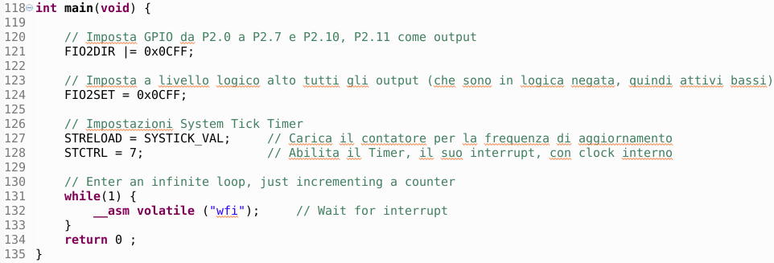
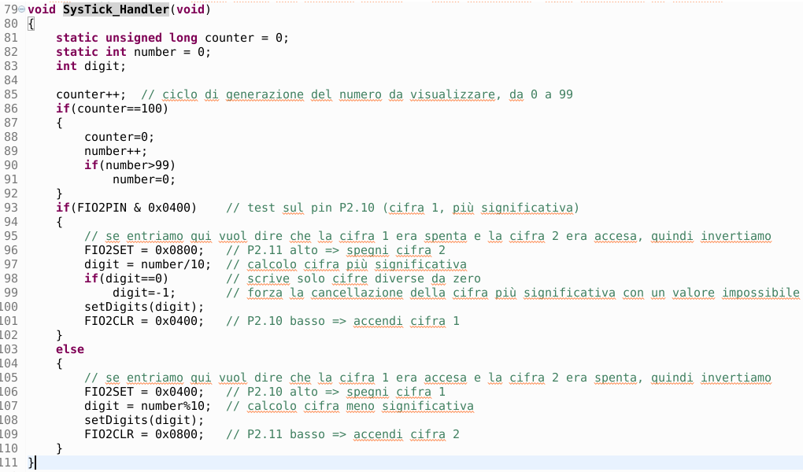
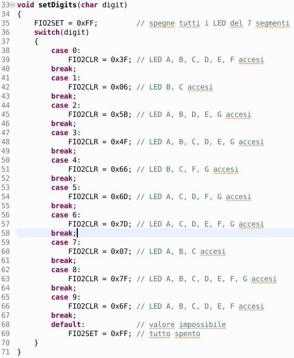

# 7-segment display management
The tutorial provides instructions for driving a 7-segment display consisting of two side-by-side digits. The acquired skills will allow to use this simple output device as a data visualization tool for a subsequent exercise.
## Introduction
The 7-segment displays are simple but effective output devices for displaying numbers or (some) letters. The ease of use linked to the simplicity of understanding their technology (LED) allows the student to learn clearly what is proposed, creating a useful basis for future exercises in which it is necessary to view results in the form of data.
## 7-segment display
7-segment displays are the simplest and oldest display devices; despite this they are still widely used both for educational purposes and in particular applications where the need for high visibility makes the use of this technology useful. In our case the device consists of a set of LEDs mounted in such a way as to form two digits according to the following figure:

  

Even if we talk about a 7-segment display, actually inside it we find 8 LEDs for each digit (7 that make up the digit plus one that lights up the decimal point). We note from the wiring diagram that the LEDs of the same digit have the anode in common while the cathodes are in common for corresponding segments in the two digits (A-A, B-B, ...). The particular architecture requires connecting one of the two anodes (pin 9 for digit 1 or pin 4 for digit 2) to the high logic level (about 3V) and then to place the current limiting resistors (in series with the cathodes of the LEDs we want to turn on) at the low logic level (0V) (in order to illuminate the respective segment). Obviously this means that we can only illuminate one digit at a time. How then to illuminate the two figures at the same time? To be precise, this would be impossible, but it becomes achievable thanks to the slowness of the human eye. In fact, if we manage to turn on the figures in different instants but very close to each other (high frequency) our eye does not notice the trick and we have the feeling that the two figures are on at the same time. Let's take an example: let's say our goal is to display the number 34. It is made up of two digits: 3 (segments A-B-C-D-G) and 4 (segments B-C-F-G). Then we must first power pin 9 (common anode figure 1) and ground the resistors of pins 10, 8, 1, 5, 7 (cathodes segments A-B-C-D-G).

  

Then we have to interrupt the power supply to pin 9 (turning off the LEDs of digit 1) and power pin 4 (common anode digit 2) and then set the resistors of pins 8, 1, 6, 7 to ground (cathodes segments B-C-F-G).

  

We note that all this can also be achieved with simple manual switches (apart from the impossibility of obtaining in this way frequencies such as to deceive our eye).

## Used material
* Development board for LPC1769 with expansion connectors
* USB cable for connection to PC
* Development station with MCUXpresso
* Software project lpc1769_7seg
* 1 breadboard
* 7-segment 2-digit display
* 8 limiting resistors of about 3.3 kΩ
* 2 PNP transistors type BC557B
* 2 transistor base control resistors of about 10kΩ
* connection cables for breadboard
## Assembly diagram
The following figure shows the assembly diagram of the proposed exercise:

  

Note that the two transistors used are polarized components (see the following figure):

  

then the pins must be mounted exactly as shown in the figure (emitter connected to the red power supply bar, collector connected to the common anode of the 7-segment display, base connected to the 10kΩ driving resistor). The 7-segment display also has an assembly order that includes decimal points at the bottom, as shown in the figure:

  

## Design of the driving circuit of the common anodes
The power supply to pins 9 and 4 of the 7-segment display (common anodes) cannot be supplied directly from the pins of the microcontroller because too much current would be required to power the lit LEDs (up to a maximum of 8 simultaneously). For this reason, a PNP type BJT (Bipolar Junction Transistor) transistor is interposed between the pin of the microcontroller and the common anode, with a base resistor of about 10kΩ (see the following figure):

  

Translation for the comment from the picture above: *the two BC557B BJTs work as switches, controlled by pins P2.11 and P2.10 of the micro. When the pin is at logic low (logic negated) the corresponding BJT is a closed switch (feeds the 7-segment display digit).*

Note that the transistors power the display LEDs when the logic value applied to the base is low (0V). Otherwise the LEDs of the corresponding digit are off (denied logic denied or active low).

## Design of the cathode driving circuit
As for the cathodes of the LEDs they are connected with the anode to the common power supply and the cathode to the current limiting resistor which in turn is connected to the output pin of the microcontroller (see figure below):

  

Note that in this case the command logic is inverted: to turn on the LED, the pin of the microcontroller must be at a low logic level (0V).

## Software analysis
### main function
Inside the main() function we find the few initial settings and the usual infinite while loop shown in the following figure:

  

The first two instructions set the control pins of the microcontroller as an output, at a high logic level. This way all the display LEDs are off. The instruction lines relating to the System Tick Timer enable it with an interrupt for a count value of 1/100 of a second.
### SysTick_Handler function
Within the interrupt management function for the System Tick Timer we find the instructions for the alternating display of the digits on the display. Since the timer is programmed for a count of 1/100 of a second it means that the two digits are updated alternately at 100Hz, i.e. the single digit is updated at 50Hz, more than enough frequency to fool the eye.

  

Within the same manager, a counting cycle from 0 to 99 is carried out for the numbers to be shown on the display, with the value increasing every second. Still in the same manager, the single digits of the number to be displayed are obtained and the LED driving function setDigits is called.
### setDigits function
This function transforms the value of the digit to be displayed in combination of pins of the microcontroller to be placed at a low logic level, based on the display LEDs that must be turned on (see the following figure):

  

Note that at the beginning of the function all the LEDs are turned off with a FIO2SET command and then are switched on selectively (switch statement) with a FIO2CLR command (negated logic).
