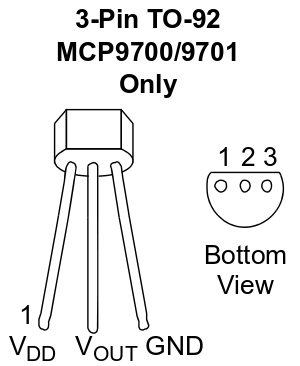

# Signal acquisition with ADC
The experiment allows the student to develop the skills for the acquisition of a voltage signal by means of an analog-digital converter (ADC), with visualization of the value on a 7-segment display.
## Introduction
Analog-to-digital conversion (ADC) is the technique that allows you to transform an analog signal (continuous in time and amplitude) into a numerical sequence that can be used by the central processor of the microcontroller. The purpose of the experience is to show how the conversion takes place and how to use it to transform a voltage signal into a number. The number obtained will then be displayed on the 7-segment display according to the procedure already seen in the experience of     [7-segment display management](../lpc1769_7seg#7-segment-display-management), to which reference should be made for the entire data display part.
## The analog-to-digital converter (ADC)
An ADC has many features but the most important are certainly: number of bits that express the result of the conversion and maximum conversion speed. These two parameters are, in the case of the LPC1769 microcontroller, equal to 12bit and 200kHz; the first parameter tells us how accurate our conversion is (resolution) while the second parameter (sample rate) tells us how many samples of the signal are converted in one second. We have 8 acquisition channels available for our ADC but in today's experience we will only use one for demonstration purposes.
## Used material
* Development board for LPC1769 with expansion connectors
* USB cable for connection to PC
* Development station with MCUXpresso
* Software project lpc1769_ADC
* 1 breadboard
* 7-segments 2-digits display
* 8 limiting resistors of about 3.3 kΩ
* 2 PNP transistors BC557B type
* 2 transistor's base control resistors of about 10kΩ
* connection cables for breadboard
* a potentiometer of about 20kΩ
* an analog temperature sensor MCP9701 type
## Assembly diagram
For this section, what already seen in the [7-segment display management](../lpc1769_7seg#7-segment-display-management) tutorial is practically repeated, except for the potentiometer or the temperature sensor connected to the ADC converter pin. The following figure shows the assembly diagram of the proposed exercise:

  

Translation of the note in the assembly diagram: *the potentiometer can be replaced by the MCP9701 temperature sensor; in this case the yellow wire goes to the central pin of the sensor.*

## Potentiometer
The component used to generate an adjustable voltage level is a potentiometer, which is a three-pin adjustable resistor, two extremes seeing the total resistance and a middle seeing a part of the total resistance based on the mechanical adjustment of the slider:

  

By connecting one end to 3.3V and the other to ground we can obtain on the central pin an adjustable voltage value between 0V and 3.3V. This voltage level goes to the ADC converter which transforms it into a proportional number between 0 and 4095 (212-1):

  

## MCP9701 temperature sensor
Instead of the potentiometer we can then mount the MCP9701 temperature sensor made in a TO92 container with three pins: power supply, output and ground:

  

The 3.3V power supply is just enough for the sensor which can have VDD input voltage from 3.1V up to 5.5V. From the data sheet we learn that the relationship between temperature in °C and output voltage in mV is the following:

  VOUT[mV] = T [°C] x 19.5 [mV/°C] + 400 [mV]

This relationship must obviously be used in the software for the correct representation of the data on the 7-segment display.

## Software analysis
As regards the software, only the parts relating to the analog-digital conversion will be highlighted, leaving out those already known for viewing the data on the 7-segment display for which please refer to the [7-segment display management](../lpc1769_7seg#7-segment-display-management) experience.
### main() function
Among the main settings we find those relating to the ADC device:

  

This is activated (at Reset it is off), set in continuous conversion mode at the minimum possible speed (the temperature varies very slowly) and with interrupt activation at the end of each conversion.

### ADC_IRQHandler() interrupt handler
This function is performed at the end of each conversion and does the bare minimum:

  

The result value is present in register *AD0DR0*, from *bit4* to *bit15*. With the *bitwise-and* operation we extract the 16 least significant bits from the *AD0DR0* register (which is 32-bit), then we shift 4 positions to the right to obtain the 12-bit value.
