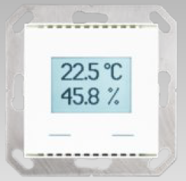
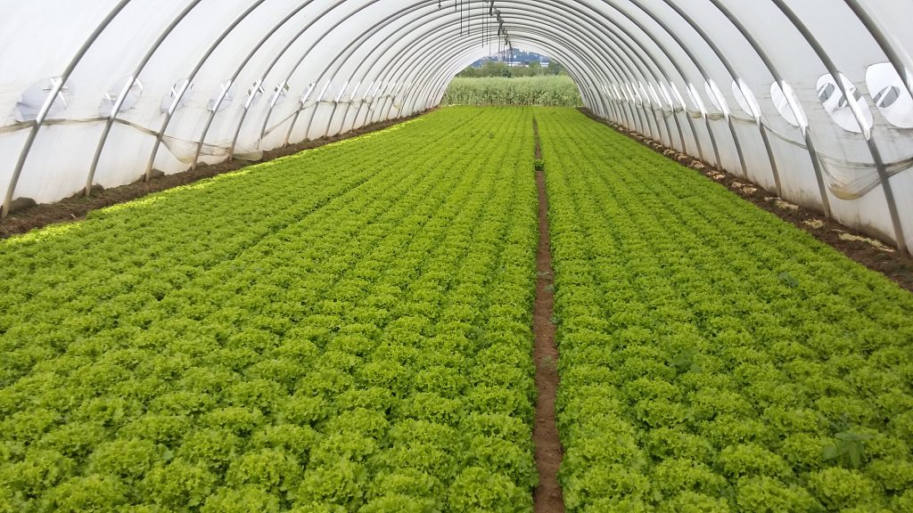

# Humidity and temperature sensor
## Introduction
 The measurement of humidity and temperature has many applications, both in the consumer field and for the production of goods and services. In the first case, just think of the devices present in all homes for the automatic adjustment of climatic parameters,  while in the second case it is possible to refer to the regulation of the microclimate in greenhouses for cultivation or in the exhibition rooms of works of art in a museum.

 In general, the integrated devices for measuring humidity and temperature provide for the correction of the reading of the first quantity based on the value read for the second, thus improving the measurement characteristics of the system. The output is digital and therefore requires the use of a microcontroller, both for display and for any remote recording or transmission.
