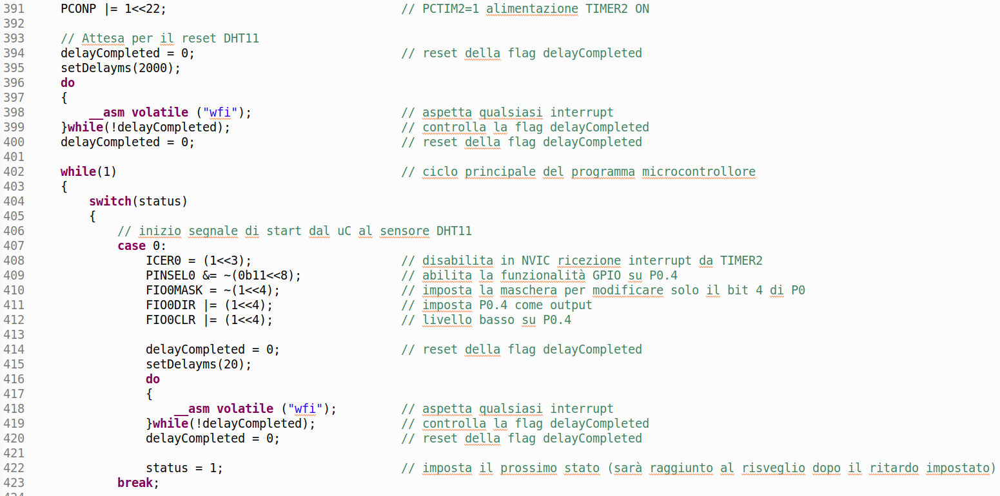
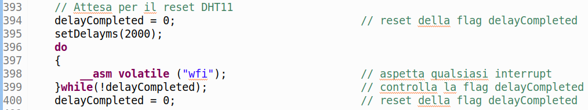
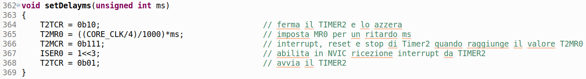
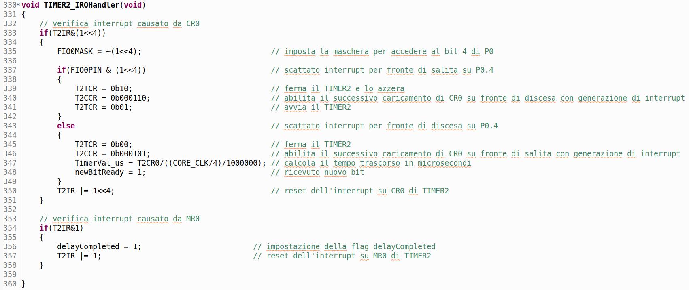
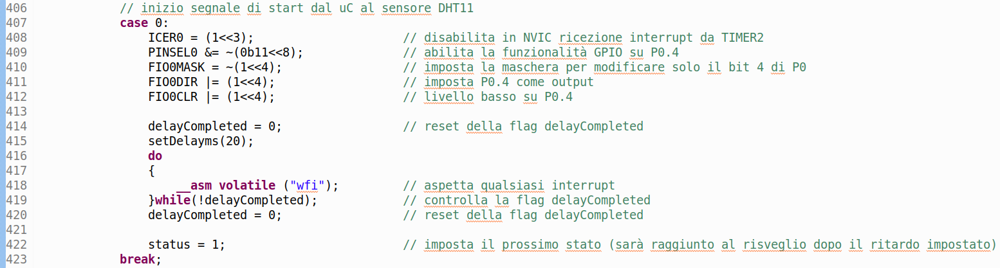
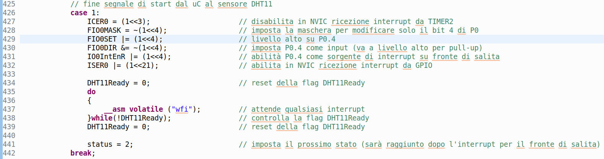
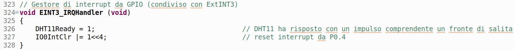

# Humidity and temperature sensor
## Introduction
  The measurement of humidity and temperature has many applications, both in the consumer field and for the production of goods and services. In the first case, just think of the devices present in all homes for the automatic adjustment of climatic parameters,  while in the second case it is possible to refer to the regulation of the microclimate in greenhouses for cultivation or in the exhibition rooms of works of art in a museum.

In general, the integrated devices for measuring humidity and temperature provide for the correction of the reading of the first quantity based on the value read for the second, thus improving the measurement characteristics of the system. The output is digital and therefore requires the use of a microcontroller, both for display and for any remote recording or transmission.
## The DHT11 module
This module is extremely used and includes 3-pin (as in our case) or 4-pin versions. The tested device is documented at the following link: [*DHT11_Temperature-Humidity_Sensor*](https://www.waveshare.com/wiki/DHT11_Temperature-Humidity_Sensor). It integrates a double humidity and temperature sensor, with digital output for both measured quantities. Data exchange takes place on a single bidirectional line.

  

The power supply and therefore the input / output logic levels are between 3.3V and 5V, thus making it perfectly compatible with the LPC1769 microcontroller running at 3.3V

The module pinout is shown in the following figure:

  

where, apart from the obvious meaning of *Vcc* and *GND*, *DOUT* represents the bidirectional data exchange pin.

The working signals of the module are shown in the following image:

  

Complete communication first involves a start phase, with a pulse sent from the microcontroller to the sensor, using the waveform shown below.

  

The sensor then responds with another impulse to signal its readiness to transmit information, using the following waveform.

  

The actual transmission of data then takes place, comprising a total of 40 bits, organized in 5 groups of 8: humidity in the whole part, humidity in the decimal part, temperature in the whole part, temperature in the decimal part, parity control. In each group the most significant bit (b7) is transmitted first, then gradually up to the least significant (b0). To distinguish bits 0 from bits 1, the device modifies the duration of the response pulse, after a fixed preamble of 50μs, according to the following graphs (approximately 26-28 μs for bit 0 and 70 μs for bit 1); by measuring this duration with a timer, the microcontroller can correctly interpret the value of the bit received.

  

The parity check is performed by adding the first 4 groups of 8 bits and comparing this sum with the fifth group of checksum.
## Assembly plan
The following figure shows the breadboard mounting plan including both the DHT11 module and the LCD display already presented in the [*Liquid Crystal Display project*](https://github.com/nicola-masarone/lpc1769-projects/tree/master/lpc1769_LCD), to which reference should be made for the general operation with the LPC1769 development board for microcontroller.

  

### DHT11 <=> LPC1769 interfacing
The only data exchange signal between the humidity and temperature sensor and the microcontroller is the *DOUT* line. Since it will be necessary to measure the duration of the pulses (to obtain the value of the bits) it is preferable to choose a pin of the microcontroller with *Timer Capture* functionality. For this reason, pin P0.4 has been selected (among other things available because it is not used for managing the liquid crystal display).
#### *DOUT*
The only data exchange line must be used in bidirectional mode. In some phases it will be set as *GPIO* in output, in others as *GPIO* in input, in others still as *Timer Capture* for pulse width measurement. The DTH11 device has a pull-up resistor of about 5kΩ on the *DOUT* line and it is therefore possible to use the internal *pull-up* of the microcontroller, activated by default at reset.

In particular, the pin *P0.4* used by us to read the *DOUT* signal is documented as follows:

  

During the different phases of the communication protocol this pin will be set as P0 [4] (*General purpose digital input/output pin*) or as CAP2 [0] (*Capture input for Timer 2, channel 0*).
### Unified power supply
Once the debugging phase is finished, if you want to use the microcontroller without connecting to the PC via USB cable, it is necessary to supply it with power using a normal wall charger or a commercial power bank with USB socket. We thus take advantage of the fact that the DHT11 sensor (as well as the liquid crystal display) receives 3.3V power from the same development board for the LPC1769.
## Firmware
The C code structure used is based on the previous [*liquid crystal display management project*](https://github.com/nicola-masarone/lpc1769-projects/tree/master/lpc1769_LCD). The rest was developed based on the need of the DHT11 module, with all the phases of the communication protocol expected. The discussion of the firmware developed is necessarily synthetic and is limited to the innovations introduced for the current project. The reader is responsible for integrating what is described with the study of the projects presented in other parts of the site. The code for the current project is on this same repository.
### *main()* function
The following figure shows a first piece of code for the *main()* function

  

The first line powers *Timer2* which starts off when the microcontroller is reset. Then there is a piece of code to set a wait, useful for resetting the DHT11 device.

  

A *delayCompleted* variable is cleared and then *Timer2* is set for a 2000 ms delay, using the *setDelayms()* function, whose code is shown below.

  

Note that in the *do-while loop* the microcontroller (*"wfi"*) is put to rest and when it wakes up the *delayCompleted* flag is still checked. This goes to the high value (causing the exit from the *do-while* loop) only when the set ms have elapsed, as can be seen in the interrupt management function of *Timer2* below (last structure *if()* below).

  

At the end of the initializations the infinite *while* loop begins in which a state machine is executed through a *switch* statement with the various *cases* corresponding to the different states of the machine.
#### *Case 0*
In the first state, the microcontroller generates the waveform for starting the protocol, using pin *P0.4* as the *output GPIO*. The start-up phase provides a 20 ms delay to give the DHT11 time to wake up. After waking up, the machine transitions to the next state.

  

#### *Case 1*
In this state, the microcontroller ends the start impulse and waits for the DHT11 to respond with a waveform to signal its readiness to transmit the humidity and temperature data. To do this, the microcontroller sets pin P0.4 as *GPIO in input*, also activating the interrupt on the rising edge of the signal (response from DHT11). It then rests waiting for the response, checking the *DHT11Ready* flag (a time-out would be needed here).

  

Note that the *DHT11Ready* flag is set high in the *P0.4* interrupt handling function.

  

Then the machine transitions to the next state.
