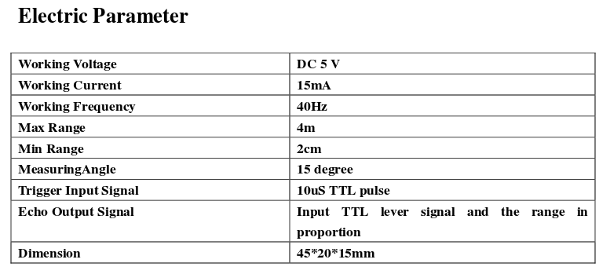

# Ultrasonic sensor
## Introduction
 Ultrasonic distance measurement has many applications, both in the consumer and industrial fields. In the first case it is enough to think of the vehicle parking sensors while  in the second case it is possible to refer to the sensor level level sensor in the tanks where physical contact between the sensor and the stored material is not desired.

In general, the distance measurement principle is based on the time it takes for the acoustic signal to travel from the transmitter to the reflective surface and return to the sensor. Knowing the speed (v) of sound propagation in the air and measuring the time (t) it takes, we obtain that the total path (s) of the acoustic wave is:

  

The distance is equal to half of the total distance s, therefore:

  

## The HC-SR04 module
This module integrates an ultrasonic emitter, an ultrasonic receiver and an electronic management part for the generation of a signal with a duration proportional to the echo delay. The [document](hcsr04.pdf) containing some technical specifications provides us with a table with indications of the electrical parameters:

  

The power supply and therefore the input/output logic levels are at 5V, which must be kept in mind when using the LPC1769 microcontroller which operates at 3.3V

The module pinout is shown in the following figure:

  

where, apart from the obvious meaning of *Vcc* and *GND*, *Trig* represents the input pin to provide the measurement start command while *Echo* is the output pin, on which we read an impulse of duration proportional to the measured time.

The working signals of the module are shown in the following image:

  

To start the measurement, it is necessary to send a TTL pulse (5V) with a duration of at least 10μs on the Trig pin and then wait for the response, from which the time elapsed for the echo return is obtained. If an excessive time elapses (about 12ms, greater than that expected for the maximum distance of 4m), the measurement is considered invalid.

## Assembly plan
The following figure shows the breadboard mounting plan including both the ultrasonic module and the LCD display already presented in the [*liquid crystal display*](../lpc1769_LCD) project, to which reference should be made for the general operation with the LPC1769 development board for microcontroller.

  

*Left side note translation: external 5V power supply and 3.3V board power supply must have common ground (GND). The 15kΩ pull-up on Trig-P0.10 is used to let the microcontroller board communicate with logic levels at 5V*

Note that the power supply represented with the batteries must actually be supplied from a 5V source and that the references of the two existing power supplies (external 5V and micro 3.3V) must be joined together to provide a common GND.

### HC-SR04 <=> LPC1769 interfacing
The logic signals shared between the ultrasound module (powered at 5V) and microcontroller (powered at 3.3V) are *Trigger* and *Echo*.
#### *Trigger*
 The *Trigger* signal is a command that goes from the microcontroller (output) to the ultrasound module. The latter expects a *TTL* signal (0-5V) while the microcontroller can only output signals (0-3.3V). Actually the logic level at 3.3V is within the high logic level acceptance range in the *TTL* specification (2-5V), as can be deduced from the following figure.

 Nevertheless, we take the opportunity to use a feature present on the output ports of the microcontroller and that is the *open-drain* setting. This feature allows you to connect an output pin of the microcontroller to a different power supply (in this case 5V) by means of an external *pull-up* resistor, as shown in the figure on the side. When the output transistor conducts the logic level VOUT is low (0V); when the transistor is off, the logic level VOUT is high and equal to VDD (in our case 5V). In this way the output of a 3.3V powered microcontroller varies between 0-5V logic levels. We note that in doing this it is advisable to disable the *pull-ups* inside the microcontroller to avoid circuit overlaps that would lead to unwanted parallels.
#### *Echo*
The *Echo* signal provides a pulse of variable duration, proportional to the delay suffered by the ultrasonic echo in its path, and of 5V amplitude. This can be connected directly to an input of the microcontroller as the *datasheet* of the micro ensures that the input pins are *5V tolerant*.

  

In particular, the pin *P0.4* used by us to read the *Echo* signal is defined as follows:

  

with *note 1* clarifying the compatibility to 5V:

  

### Unified power supply
Once the *debug* phase is finished, if you want to use the microcontroller without connecting to the PC via USB cable, it is necessary to supply it with power from the external 5V. To achieve this, simply connect an additional red cable (not shown in the previous assembly plan) between the external 5V supply and the *EXT_POWX* pin, position 2 of the expansion connector of the development board for LPC1769.

## Firmware
The structure of the C code used is quite simple. The part of the firmware relating to the display of the measurement result is obtained from the [*liquid crystal display*](../lpc1769_LCD) project, presented in another part of the site. The rest has been developed according to the need of the ultrasonic module: generation of a *trigger* pulse of at least 10μs duration and capture of the *Echo* signal with measurement of its duration. A timed cycle cadence is also provided: generation of the *Trigger* pulse, measurement of the duration of the *Echo* signal, updating of the result on the display. To achieve this, the *SyTick Timer* is used as a timer for the cycle of operations, the *Timer3* for the realization of the *Trigger* pulse and the *Timer2* for the capture and measurement of the *Echo* signal.

The project files are downloadable from this same repository.

### *main()* function
The following figure shows the code of the *main()* function:

  

The first lines of the code set the *SysTick Timer* to generate an interrupt signal with a frequency of 64 Hz, dictated by the *SYSTICK_VAL* value. The initialization functions of the two Timers and the display are then invoked: *initTimer3Match()*, *initTimer2Capture()* and *initLCD()*.

At the end of the initializations the infinite *while* loop begins in which the processor goes into standby waiting for the interrupt signal of the *SysTick Timer*.

### *InitTimer3Match()* function
The following image shows the code for the preparation of *Timer3* as a pulse generator of preset duration for the *Trigger* signal (start of measurement command for the ultrasound module).

  

The first instruction powers *Timer3* which is off when the micro is *reset*. The second instruction connects pin *P0.10* to *MAT3.0*, that is to channel *0* of *Timer3* for the pulse generation function. The next instruction disables all internal resistors of pin *P0.10* as we intend to use an external 5V pull-up. The last instruction of the first group enables the *OpenDrain* functionality on *P0.10*.

Thereafter, the stop of *Timer3* is programmed when the preset count is reached, after 15μs, with the reset of the logic level on *P0.10*. Finally, an initial value is set at low *P0.10*.

### *InitTimer2Capture()* function
The code for this function is presented in the following image; it must prepare the duration measurement of the *Echo* signal returned by the ultrasound module.

  

In the first instruction, *Timer2* is powered (turned off when the microswitch is reset) then *P0.4* is connected to channel *CAP2.0* (*timer2* capture channel *0*). In subsequent instructions, the internal *pull-up* and *pull-down* resistors are disabled. The *Timer2* control register provides for the storage of the count value and the *interrupts* are activated both on the rising edge (start of *Echo* pulse) and of descent (end of *Echo* pulse). In the last instruction, the interrupt signals are routed through the NVIC module.

### *InitLCD()* function
The following image shows the code of the *initLCD()* function:

  

All the pins of the microcontroller responsible for driving the [liquid crystal display](../lpc1769_LCD) are set in output (remember that at *Reset* all the *GPIO* pins are in input).

### *SysTickTimer* Handler
The *SysTickTimer* interrupt causes the execution of the code shown in the following image (representation of an initial fragment):

  

Recall that the *SysTickTimer* clicks 64 times per second; the first 64 times (therefore for a time interval of 1 second) the if structure is skipped by executing the following code (not displayed) to refresh the data on the LCD display (for more details see the [Liquid crystal display](../lpc1769_LCD) project). After this interval, the code in the *if* structure is executed, obtaining the distance in cm from the *TimerVal* variable (duration of the *Echo* pulse in μs). This variable is global and is updated with the result of the last *Echo* measurement in the *TIMER2_IRQHandler()* presented later. In the following lines, the 4 digits that make up the distance value in centimeters are obtained. Finally, *Timer3* is launched to generate a new 15μs impulse for the *Trigger*.

### *Timer2* Handler
The *TIMER2_IRQHandler* is shown in the following figure:

  

Recall that this manager is performed both on the rising edge of *P0.4* (start of the *Echo* pulse) and on the falling edge (end of the *Echo* pulse). To distinguish the two cases, the bit4 of *FIO0PIN* is tested: if it is high we are in the presence of the rising edge, the *Timer2* is reset and started for the measurement. When bit4 is low, the falling edge has arrived: *Timer2* is stopped and the duration between the two edges is recorded in the *TimerVal* variable (in μs).

## Possible improvements
+ Distance measurement currently predicts a constant speed of sound in air but in reality it depends on the ambient temperature. A temperature measurement functionality could be added to appropriately correct the distance data.
+ The project could be modified to perform measurements that are no longer cyclical (as now, once a second) but on command, by means of a measurement start key.
+ Wanting to mimic the behavior of the parking sensors, the management of a buzzer could be added which activates with a sound of increasing frequency when the measured distance value falls below a certain threshold.
