# The *I2C* bus
Among the various communication buses available, the *I2C* has proved to be among the most flexible and easy to use over time, determining its success and rapid diffusion in various fields of automation. To adequately present this bus, we will refer to the official documentation of NXP, the parent company of the standard born in 1982, when the manufacturer was still called Philips. The specification file is available at the following address: [*I2C-bus specification and user manual*](https://github.com/nicola-masarone/lpc1769-projects/blob/master/lpc1769_I2C/UM10204.pdf). This document, now in its sixth revision, was last updated on 4 April 2014. Further information on *I2C* compatible products or on the related NXP documentation can be found at the following address: [*I2C-bus Portfolio*](http://www.nxp.com/products/interface-and-connectivity/interface-and-system-management/i2c-bus-portfolio:MC_41735).

The following does not purport to replace or translate the official document, but is intended only as a guided tour of the *NXP* standard. Nevertheless, for ease of use, the path will be articulated by referring to the same paragraphs of the standard document.
## Introduction
The *I2C* bus now represents what is called a *de facto* standard, that is a technology which, although not regulated by any supranational technical body, is equally recognized and used by at least 50 manufacturers of electronic components for over 1000 different types of integrated circuits. The document aims to present both the logic and electrical specifications of the standard and is aimed at both users of *I2C* devices and developers of such devices.
## Characteristics of the *I2C* bus
It often happens that in electronic projects, even of a very different nature, there are similarities as regards the organization of the control infrastructure. We therefore find one or more intelligent devices connected to various peripherals for the realization of the most disparate functions. To create a reusable and scalable communication technology, then *Philips Semiconductor* (now *NXP*) thought of developing a two-wire, bidirectional, serial communication bus called *Inter-Integrated-Circuit* (*IIC* or *I2C*).

The peculiarity of this bus is that it implements the operating logic at the hardware level, directly in the integrated devices. This means that an *I2C* temperature sensor contains the communication interface towards the bus and is able to communicate directly, without other additional components.

Some features of the bus are:
+ two communication lines, *SDA* (*serial data*) and *SCL* (*serial clock*)
+ each device on the bus has a unique address, with *master-slave* relationships. (remember that in a *master-slave* organization, the *master* commands and the *slave* obeys); the *masters* can act as transmitter or receiver
+ *multi-master* technology with collision detection and arbitration, in the event that several masters decide to simultaneously take control of the same bus
+ *bidirectional* 8-bit serial data transfers can take place with speeds up to 100kbit/s (*Standard-mode*), 400 kbit/s (*Fast-mode*), 1 Mbit/s (*Fast-mode Plus*), 3.4Mbit/s (*High-speed mode*)
+ *unidirectional* 8-bit serial data transfers can take place up to 5Mbit/s (*Ultra Fast-mode*)
+ filtering integrated in the data line chip to eliminate disturbances
+ the maximum number of devices that can be connected on the same bus is limited only by the total equivalent capacity (more devices, more lines, more nF)

In the following figure some examples of applications on *I2C* bus:

  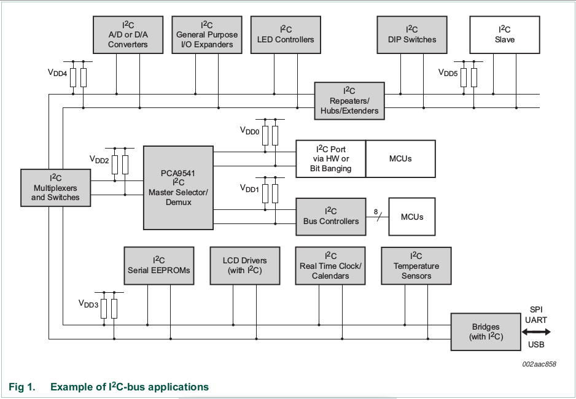

Taking a cue from the figure, let's analyze the possible architectures of the *I2C* bus. We note that there are several masters (*MCU*s), some with direct bus management (built-in control *hardware* or in *bit-banging* mode) and others with external bus management through additional controllers.

  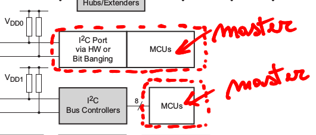

The two-wire lines coming out of the masters are connected to two *pull-up* resistors, one for *SDA* and the other for *SCL*.

  

The separate bus sections are recognizable precisely by the *pull-up*s, which cannot be repeated on the same section as they would result in parallel with each other, with overall resistance lower than the value required by the specifications. We also observe that on the different sections there may be different power supplies, as indicated by the labels VDD0 ... VDD5

  

We note that between the sections there are elements dedicated to the connection between them, each with specific properties. The figure below shows a *master* selector element, a section selector element and a signal repeater element.

  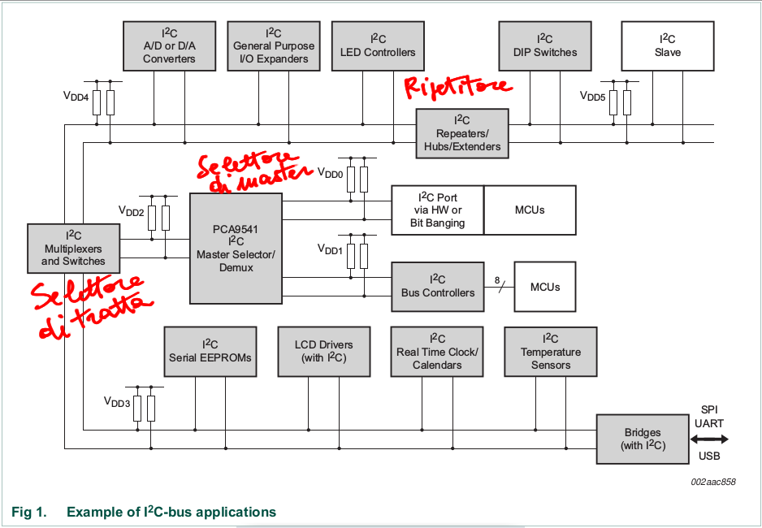

Among the *I2C* devices of the above diagram there is also a *bridge*, that is a translator element capable of making the *I2C* bus communicate with other buses (eg *SPI, UART, USB*).

  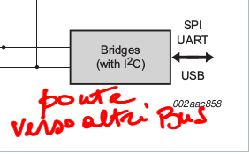

## The *I2C* bus protocol
### Standard-mode, Fast-mode and Fast-mode Plus protocols
The information between the various devices is carried on a two-wire (*SDA* and *SCL*), bidirectional line, in which each element can act as a transmitter (one at a time) or as a receiver (many at the same time), being uniquely identified with a your address.

Some devices by their nature can be both transmitters and receivers (microcontrollers, memories) while others can only be receivers (eg displays).

The devices on the bus also act as *master* or *slave*: the former initiate and terminate the communication, addressing the *slaves* involved and managing the clock signal on the bus; the latter wait to be addressed by a *master* and obey his requests.

Some devices (such as microcontrollers) can change their role, from *master* to *slave* or vice versa. At all times, however, there can be only one active *master* on the bus with many *slave*s. In the following figure some terms used in the *I2C* specifications:

  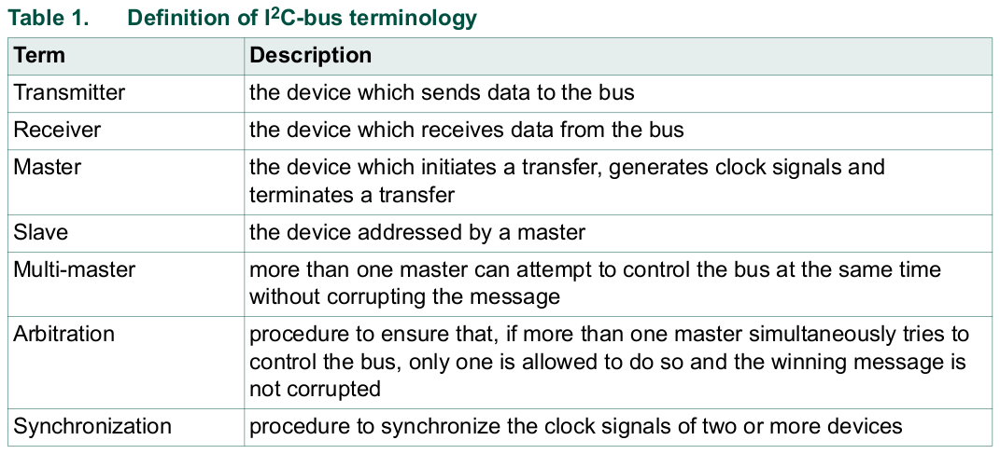

Arbitration is a procedure used in the event that several *masters* decide to initiate a communication on the same bus at the same time; this procedure regulates which of the *masters* has precedence. Synchronization, on the other hand, allows alignment between the clock signals of different devices.

The *masters* present on the bus are usually microcontrollers. In the following figure we represent a structure in which the two *masters* communicate with each other:

  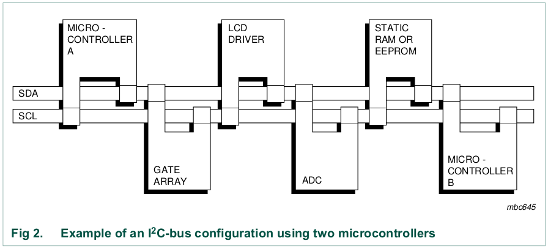

Relations of the *master/slave* and *transmitter/receiver* type are not immutable over time and depend on the direction of data transfer.

Suppose that microcontroller A wants to transmit data to microcontroller B: in this case A is both *master* (starts communication, addresses B, manages data exchange, ends communication) and *transmitter* (sends data to B); at the same time B is both *slave* (receives the addressing of A) and *receiver* (receives data from A).

Another possibility is that microcontroller A wants to receive data from microcontroller B: in this case A is both *master* (initiates communication, addresses B, manages data exchange, ends communication) and *receiver* (receives data from B); at the same time B is both *slave* (receives the addressing of A) and *transmitter* (transmits the data to A).

Obviously it is also possible that the microcontroller B becomes *master* and that A is *slave*.

The fact that there can be more *masters* on the same bus creates the possibility that they try to manage communication at the same time. To avoid confusion in the data, an arbitration procedure has been envisaged to decide the priority between *masters*.
### The SDA and SCL signals
The SDA and SCL lines are bidirectional and are connected to the power supply via a pair of pull-up resistors (see following figure).

  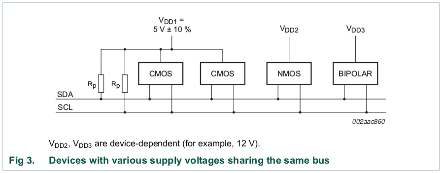

When the bus is free, both lines are at a high logic level; the various devices present can interact with logic called *wired-AND*: in practice it is enough for a single device to keep a line low for it to stay at "0" overall (even if all the other devices indicate a logic level "1" ). For this to happen, the various devices on the lines must have *open-drain* (or *open-collector*) output stages: when they emit "0" they impose the electrical level low while for the logic level "1" they simply release the line.
### SDA and SCL logic levels
Given the great variety of *I2C* devices with different technologies (CMOS, NMOS, bipolar) the electrical levels associated with the logic are not fixed, with thresholds at 30% and 70% of the supply voltage.
### Validity of the data
The *SDA* line can only change level while the clock signal (*SCL*) is low.

  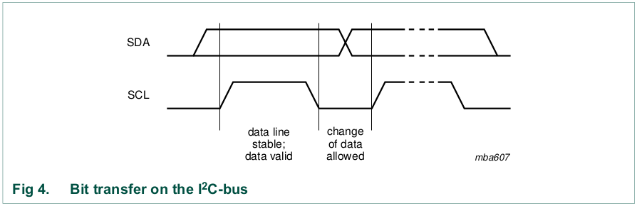

During the time intervals when *SCL* is high the *SDA* line must remain stable.
### The Start and Stop conditions
All communications begin with Start (abbreviated with S) and end with Stop (abbreviated with P).

  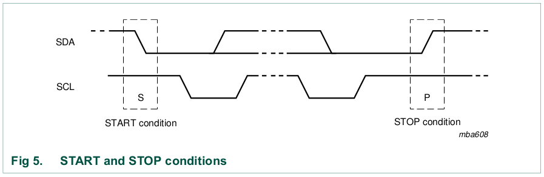

The Start condition is obtained by keeping *SCL* high and forcing a transition of *SDA* from high logic level to low logic level (falling edge); the Stop condition, on the other hand, is obtained by taking *SDA* from low logic level to high logic level (rising edge) while *SCL* is high. We note that *SCL* kept high during the *SDA* variation allows not to confuse the Start and Stop conditions with a data bit (see previous paragraph).

The Start and Stop conditions are always generated by the *master*; the bus is considered busy after a Start and free after a certain time from the Stop.

After a Start, a repeated Start (abbreviated with Sr) can be issued: in this case the bus remains busy until the next Stop. In cases where Start and Repeated Start are functionally identical, they are indicated with the same abbreviation (S).
### Byte format
The bytes on the bus must consist of 8 bits, with *MSB first* transmission (first the most significant bit, then the others, up to the least significant or LSB). The maximum number of bytes is not fixed and depends on the applications.

  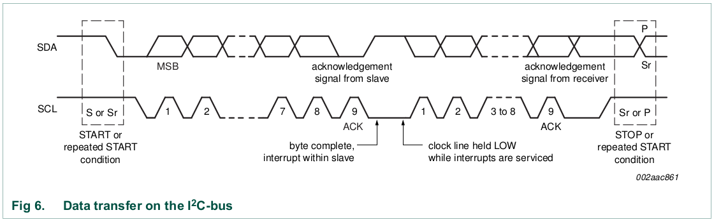

At each clock pulse on the *SCL* one of the 8 bits of the byte is sent (in this phase the *transmitter* writes on the *SDA* line). Subsequently, at the ninth clock pulse, the confirmation of receipt (*ACK*) occurs, with the *receiver* placing the *SDA* line at a low logic level.

If in this phase the *receiver* needs further time for internal data processing, it can signal this request to the *transmitter*, keeping the *SCL* line blocked at a low logic level. Then when the *receiver* is ready for other data, it unlocks the *SCL* line, allowing the *transmitter* to continue the communication.
### Received (ACK) and not received (NACK)
The ACK bit (9th bit) is present at the end of each byte, as a signal from the *receiver* of the complete receipt of the byte. The clock pulses (both the 8's of the byte and the 9th of ACK) are generated by the *master*. If during the 9th clock pulse the *SDA* line is not lowered then a NACK (Not ACKnowledge) condition occurs. In this case the *master* can choose to terminate the communication (Stop condition) or try again (repeated Start condition).

There are five conditions that lead to a NACK situation:

1. the device addressed by the *master* is not present on the bus, therefore no one responds to communication with ACK;
2. the addressed device is engaged in operations that do not allow it to communicate with the *master*;
3. the addressed device does not understand the received byte;
4. the addressed device is unable to receive further bytes;
5. a *master-receiver* must signal the end of communication to a *slave-transmitter*.

### Clock synchronization and arbitrage
In a single *master* system there is no need for these functions, useful for avoiding collisions between simultaneous communications of multiple *masters*.
### Slave address and R/W bit
Data transfer follows the scheme shown in the following figure:

  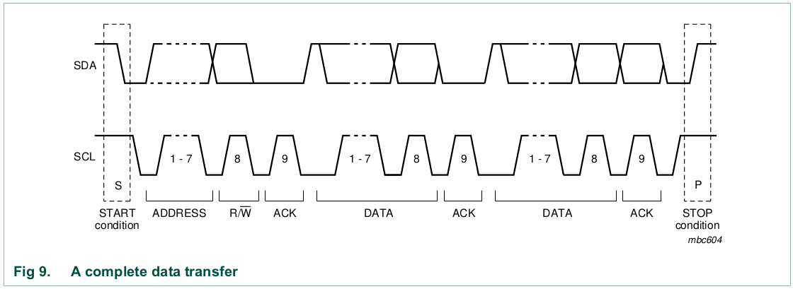

The *master*, after the Start condition (S), outputs the 7-bit address of the *slave* concerned, plus an additional bit to indicate the communication direction: Read (bit "1") or Write (bit "0").

  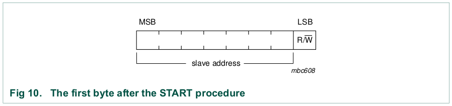

During the 9th clock pulse the *slave* responds (if it can) with ACK ("0") on the SDA line. We note that with 7 address bits it is possible to identify up to 27 (128) different devices.

A communication is always terminated with a Stop condition, but if the *master* wants to continue to occupy the bus it can instead issue a repeated Start condition and possibly address another *slave*.

There can be various data transfer formats:

+ a *master-transmitter* communicates with a *slave-receiver*; the transfer direction does not change and the *slave* signals ACK to each byte received

  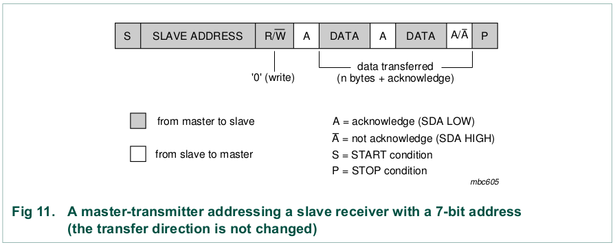

Note that the gray parts represent communications from *master* to *slave*, while the white parts represent communications from *slave* to *master*.

+ the *master-receiver* reads from a *slave-transmitter*; the communication changes direction because it begins with a writing of the address by the *master*, followed by ACK by the *slave*; then the *slave* becomes the *transmitter* and the *master* becomes the *receiver*, with ACK from this to every byte, except the last one, immediately before the Stop condition

  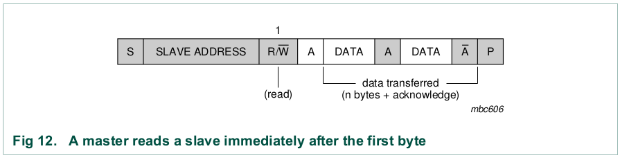

