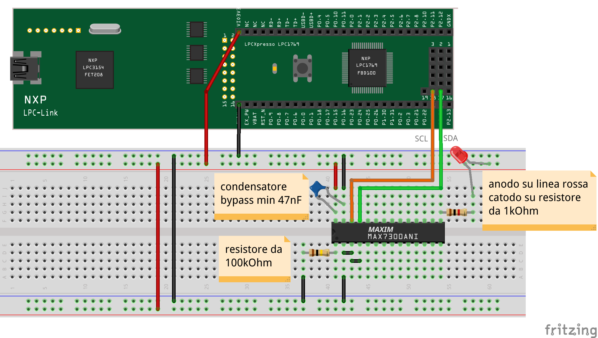

# MAX7300 I2C I/O expander tutorial
[*MAXIM's integrated MAX7300*](https://github.com/nicola-masarone/lpc1769-projects/blob/master/lpc1769_I2C/max7300.pdf) is an input/output expansion device (I / O expander) useful for having many more pins without engaging all the ports of the microcontroller.

Below you will find the breadboard assembly plan proposed for a project test:

  

In the example shown, a red LED is connected to pin 15 of the MAX7300 chip, corresponding to P22 of the input/output port. The assembly foresees the activation of the LED when the door output is at a low logic level (0V); the anode of the LED, in fact, is fixed at the power supply value (3.3V) while the cathode is in series with the current limiting resistor. The choice is not random and derives from reading the MAX7300 datasheet: can you justify this solution?

The programming code to be used with MCUXpresso is reported in this same repository.

The program allows the LED to switch on with two successive pulses of light. At the end the LED is left off.

The design can, of course, be modified to make all 20 I/O pins of the MAX7300 work. In this way, with only two pins of the microcontroller (SDA1 and SCL1), we can control 20 different inputs/outputs. Considering then that on the same [*I2C bus*](https://github.com/nicola-masarone/lpc1769-projects/blob/master/lpc1769_I2C/I2C.md) we can connect up to 16 integrated MAX7300 we get a maximum of 16x20 = 320 input / output pins manageable with a pair of pins of the microcontroller. Not bad.
