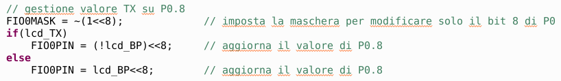

# Liquid crystal display
 In this project the piloting technique of a liquid crystal display (LCD) is presented. We will study how the display segments are switched on by writing a test program for automatic counting from the value 0 to the value 1999.
## Introduction
Liquid Crystal Displays (LCDs) are widely used devices for displaying data. Sometimes these displays are segmented (as in our case) other times they are dot matrix. The former allow the display of digits and characters while the latter can also display images. Segment LCD displays have a similar display to that seen for 7-segment LED displays but have a completely different driving principle; in fact, since they are made with liquid crystals, they must be controlled with alternating voltages to continuously reverse the direction of the current inside the segments. If we did not do this we would have two drawbacks: we would not display anything and we would damage the display irreparably. We add for completeness that there are LCD modules on the market already equipped with internal controller (type HD44780); in this case, the use of the display consists in simply sending appropriate commands to the module which already provides an integrated logic for driving the individual segments.
## 7-segment LCD
 The organization of the segments is shown in the figure to the side. The backplane (indicated in the figure as Common Plane) represents a common reference plane with respect to which all the segments in the foreground of the display are powered. In practice, a segment lights up if the potential at its pin is different from the potential on the backplane pin; the segment is turned off if it has the same potential as the backplane.  Since we want the current in the segments to continuously change direction then we will send a square wave signal of suitable frequency (usually above 30Hz to avoid flickering) on the backplane pin and square wave signals with the same frequency on the segment pins, with voltage value equal to the backplane to keep segments off or different value to keep segments on.
From the figure on the side it is clear that the segment lights up (Lit) when the voltage between Common and Segment is different from zero (i.e. when the signal on Common is different from that on Segment). Furthermore, when this happens, the value is alternated so as not to damage the segment.
## Characteristics of the display used
The display used is a 3 1/2 digit, typically used in portable instruments such as multimeter or temperature meter. The extremely small datasheet can be downloaded from [here](JAZZ-EC-NMW.pdf). As you can see, the device has 40 pins, not all used, documented in the following table:

  

The names of the LCD segments corresponding to the pins are shown in another image taken from the datasheet:

  

With 3E, for example, the E segment of the digit 3 is indicated; with 2A the segment A of the digit 2. The segments in the digit are organized as in the LED ones, but for convenience we report it in the following figure:

  

## Mount on breadboard
Given the width of the display, the assembly requires the use of two small breadboards side by side or, equivalently, a large breadboard, as seen in the following figure:

  

Note the presence of two 15kΩ pull-up resistors between the 3.3V power supply and pins 25-26 of the display, corresponding to pins P0.27 and P0.28 of the microcontroller which are open-drain as they can be used for the bus I2C. The 3.3V power supply must obviously be brought to the breadboard with a special wire. There are 30 connection cables, so 10 additional cables are required compared to those supplied by the kits.

## Description of the software used
Premise: the "C" program seems very long but in reality it is simply repetitive, that is, it should be written better, more compactly. The reason it was written this way is to make it clearer for those who don't have much programming experience. The compressed file of the project can be downloaded from this same repository.
### The *main()* function
Let's start as usual by taking a look at the *main()* function, shown in the following figure:

  

The few instructions given only concern the setting of quite a few pins of the P0, P1 and P2 port as output for the management of the LCD segments. Follow the usual instructions for the *System Tick Timer* which is used here to generate the constant frequency square wave for the backplane pin. The chosen timer value is obtained with the operation:
*
96000000/64 - 1
*
In this way we guarantee a timer frequency of 64 Hz, corresponding to a time interval of 1/64 of a second (i.e. 15,625 ms).
### The *SysTick_Handler()* function
We said that the interrupt handling function of the SysTick Timer is invoked every 15,625 ms. After a time equal to this interval, the backplane signal inverts its logic value, therefore the value of the total period is equal to double: 15.625ms • 2 = 31.25 ms, corresponding to a frequency of 32 Hz (frequency sufficient for a stable display display).
#### *Backplane* signal update
The following figure shows the LCD display backplane signal management code, wired on pin P0.9 of the microcontroller:

  

The *lcd_BP* variable contains the current logical value of the *backplane* signal. With instruction:

    lcd_BP = !lcd_BP;
we invert the logic value at each interrupt trip, generating a square wave at 32 Hz. Subsequently with the instruction:

    FIO0MASK = ~(1<<9);
we apply a mask on port P0 to make only bit9 (P0.9) editable. We note that the expression to the right of the equal holds:
*
~(1<<9) = 111111111111111111111110111111111
*

We then update the value of P0.9 with the instruction:

    FIO0PIN = lcd_BP<<9;
In practice we attribute to *P0.9* the current value of the *lcd_BP* variable which alternates its logical value at each call of the *SysTick_Handler()* function.
#### Segment signal update
Below we see the *TX* segment management code (*minus sign* of the display), wired on pin *P0.8* of the microcontroller; obviously what will be explained will also apply to all the other segments of the display.

  

The first instruction applies the mask to port *P0* to make only *bit8* editable:

    FIO0MASK = ~(1<<8);
The next statement uses an *if-else* structure with a logical condition based on the current value of the *lcd_TX* variable. If this variable is different from zero it signals that the respective *TX* segment must be displayed otherwise it must be turned off. In the first case (*TX* on) the instruction is executed:

    FIO0PIN = (!lcd_BP)<<8;
which assigns to pin *P0.8* a logic value opposite to the *backplane* (thus current flows through the *TX* segment).

In the second case (*TX* off) the instruction is executed:

    FIO0PIN = lcd_BP<<8;
which assigns the same logic value as the *backplane* to pin *P0.8* (so no current flows in the *TX* segment).
#### Test count
Within the same *SysTick_Handler()* function a piece of code for the display test has been obtained. From the following figure we notice what is achieved:

  

