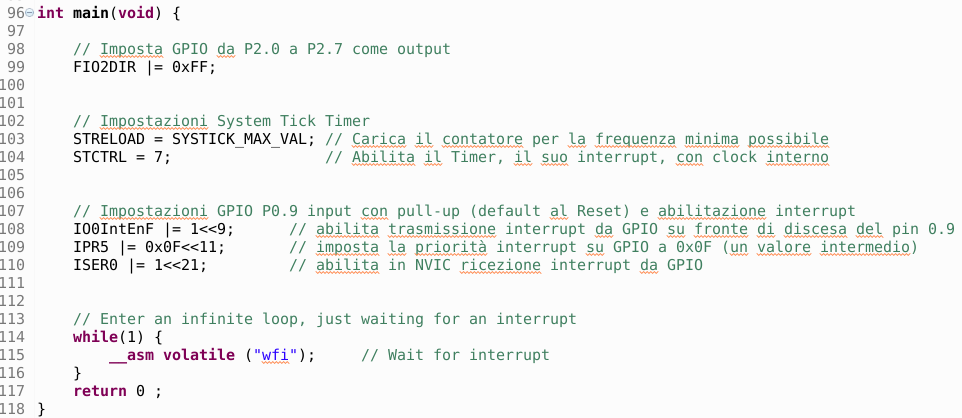
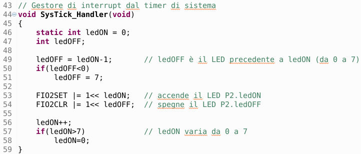
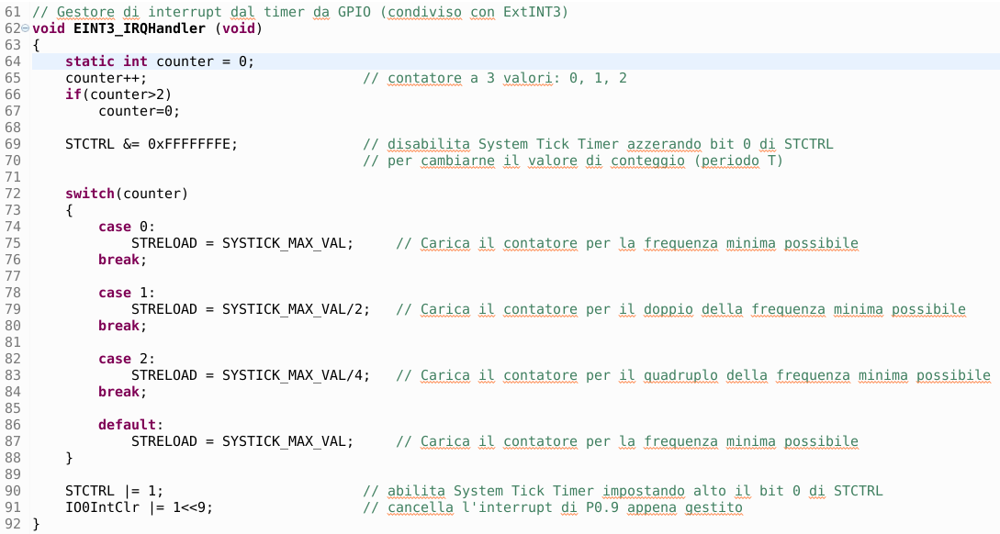

# LED in sequence with variable speed
The experience involves the use of 8 LEDs to be switched on in sequence with adjustable speed, based on the pressure of a button. The skills acquired at the end of this practical include the use of GPIO in input and output, with interrupt management on the input. The system timer is also used with relative management of the interruption for the switching speed of the LEDs.
## Introduction
The experience has as its objective the lighting in sequence of 8 LEDs with adjustable speed, based on the pressure of a control button. The skills acquired concern:
+ use of GPIO in input and output;
+ sizing of the driving circuit of an LED;
+ management of a command button by managing the interrupt on inputs;
+ use of the System Tick Timer and its interruptions for the timing of operations
+ use of the MCUXpresso development system for program design, storage and debugging.
+ use of breadboard and development board for LPC1769 for practical tests
## Used material
+ Development board for LPC1769 with expansion connectors
+ USB cable for connection to PC
+ Development station with MCUXpresso
+ Software project lpc1769_LEDs
+ 1 breadboard
+ 8 LEDs
+ 8 limiting resistors of about 1.5 kΩ
+ a breadboard button
+ connection cables for breadboard
## Assembly diagram
The following figure shows the assembly scheme provided for the experience, made with the free Fritzing drawing software:

  

Note that the limiting resistors are 1.5kΩ and the LEDs are all mounted with the cathode (short lead, flat side of the LED) on the blue ground line of the breadboard.

## LED driver circuit design
The analog section relating to the LEDs is made up of a current limiting resistor placed in series with the LED. Everything is powered by the output of the microcontroller's GPIO port, according to the diagram in the following figure:

  

For the sizing of the R_LED resistor we must take into account the output voltage of the logic gate of the microcontroller when it is at the high logic level (about 3.1V) and the threshold voltage of the red LED which is around 1.8V. Given that we want a current in the LED lower than 1mA, we calculate the value of R_LED with the following formula:

  

By choosing a slightly higher standard value, we ensure a current lower than 1mA; this guarantees a correct functioning of the output ports since in the datasheet we find a guaranteed minimum output current value of 4mA:

  

## Push button input circuit design
The analog section relating to the push-button input is shown in the following figure:

  

The input pin has the internal pull-up resistor activated; in this way when the external button is open (released) the gate logic level is high (about 3V). When we press the external button, the switch closes and the gate logic level drops (0V). In the following graph we report what has been said, highlighting the falling and rising edges of the input signal:

  

Translation of picture notes written in Italian language: *released button, falling edge, pushed button, raising edge, released button*

When the button is pressed, the logic level of the input goes from high (3V) to low (0V); this is the falling edge which will be used as the interrupt event for the P0.9 input.

## Software analysis
Let's now proceed to the study of the various sections contained in the software project lpc1769_LEDs.
### *main()* function
Inside the *main()* function we find the few settings needed to start the program.

  

We note that the first instruction sets as output the pins of port 2 ranging from P2.0 to P2.7, placed in both logical sequence and on the expansion connector of the development board for LPC1769.

The following instructions set the *SysTickTimer* to operate with the maximum possible period and to activate the interrupt at the end of each counting cycle.

The last block of instructions concerns pin P0.9 which is set as an input with pull-up (default at the reset of the microcontroller) and the interrupt on the falling edge of the input signal is activated. For a detailed discussion of interrupts and their management with NVIC, please refer to a specific lesson.

At the end of these few initial settings, the program enters an infinite *while* loop waiting for an interrupt event that wakes it from waiting: *__asm volatile ("wfi")*.

### *SysTick_Handler()* interrupt handler
At the end of a *SysTickTimer* counting period, the program automatically jumps to the following *SysTick_Handler()* management function:

  

The purpose of this function is to always turn on one LED at a time, changing its position at each interrupt activation cycle. The *static int ledON* variable contains the position of the LED to be turned on (initialized to 0) and retains this value even when exiting the function (*static* attribute). The *int ledOFF* variable instead contains the position of the LED to be turned off and is equal to the position preceding *ledON*. Since the possible positions range from 0 to 7, the limit values are checked with adjustments if necessary (a value less than 0 becomes 7 and a value greater than 7 becomes 0). In this way, at each completion of a *SysTickTimer* counting cycle, an LED next to the previous cycle is turned on while the one that was on before is turned off (traveling LED).

### *EINT3_IRQHandler()* interrupt handler
This interrupt handler intercepts the pressing of the button connected to P0.9 and is shown in the following figure:

  

The purpose of this function is to change the count value of the *SysTickTimer* and therefore the on/off speed of the LEDs. The *static int counter* variable (initialized to 0) can take only three values: 0, 1 and 2, then it returns to the value 0. Subsequently, the *System Tick Timer* is temporarily stopped to modify its count value. With the switch selector you choose (based on the current counter value) which value to assign to the *System Tick Timer*, passing from the maximum value (minimum speed), to the middle value (middle speed) to the minimum value (maximum speed). The last instructions are used to reactivate the *System Tick Timer* (with the count value just changed) and to clear the button press event because otherwise it would take us back to this function indefinitely even if we stop pressing the button.
