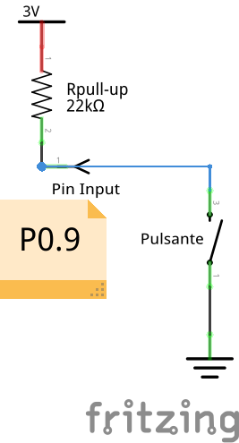

# LED in sequence with variable speed
The experience involves the use of 8 LEDs to be switched on in sequence with adjustable speed based on the pressure of a button. The skills acquired at the end of the experience include the use of GPIO in input and output, with interrupt management on the input. The system timer is also used with relative management of the interruption for the switching speed of the LEDs.
## Introduction
The experience has as its objective the lighting in sequence of 8 LEDs with adjustable speed based on the pressure of a control button. The skills acquired concern:
+ use of GPIO in input and output;
+ sizing of the driving circuit of an LED;
+ management of a command button by managing the interrupt on inputs;
+ use of the System Tick Timer and its interruptions for the timing of operations
+ use of the LPCXpresso development system for program design, storage and debugging.
+ use of breadboard and development board for LPC1769 for practical tests
## Used material
+ Development board for LPC1769 with expansion connectors
+ USB cable for connection to PC
+ Development station with MCUXpresso
+ Software project lpc1769_LEDs
+ 1 breadboard
+ 8 LEDs
+ 8 limiting resistors of about 1.5 kΩ
+ a breadboard button
+ connection cables from breadboard
## Assembly diagram
The following figure shows the assembly scheme provided for the experience, made with the free Fritzing drawing program:

  

Note that the limiting resistors are 1.5kΩ and the LEDs are all mounted with the cathode (short lead, flat side of the LED) on the ground line of the blue breadboard.

## LED driver circuit design
The analog section relating to the LEDs is made up of a current limiting resistor placed in series with the LED. Everything is powered by the output of the microcontroller's GPIO port, according to the diagram in the following figure:

  

For the sizing of the R_LED resistor we must take into account the output voltage of the logic gate of the microcontroller when it is at the high logic level (about 3.1V) and the threshold voltage of the red LED which is around 1.8V. Given that we want a current in the LED lower than 1mA, we calculate the value of R_LED with the following formula:

  

By choosing a slightly higher standard value, we ensure a current lower than 1mA; this guarantees a correct functioning of the output ports since in the datasheet we find a guaranteed minimum value of 4mA:

  

## Push button input circuit design
The analog section relating to the push-button input is shown in the following figure:

  

The input pin has the internal pull-up resistor activated; in this way when the external button is open (at rest) the logic level of the door is high (about 3V). When we press the external button, the switch closes and the door logic level drops (0V). In the following graph we report what has been said, highlighting the falling and rising edges of the input signal:

  

Translation of picture notes written in Italian language: *released button, falling edge, pushed button, raising edge, released button*
When the button is pressed, the logic level of the input goes from high (3V) to low (0V); this is the falling edge which will be used as the interrupt event for the P0.9 input.

## Software analysis
Let's now proceed to the study of the various sections contained in the software project lpc1769_LEDs.
### main() function
