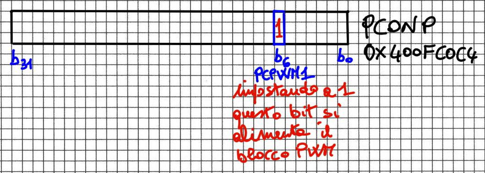
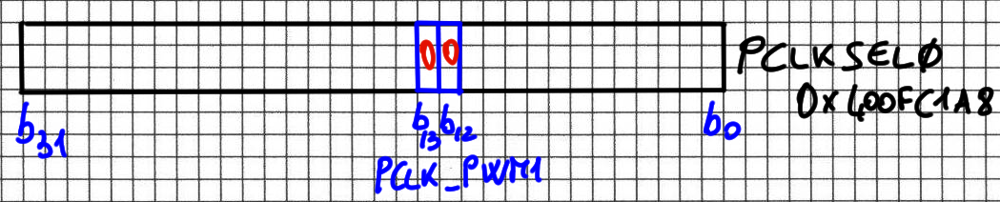
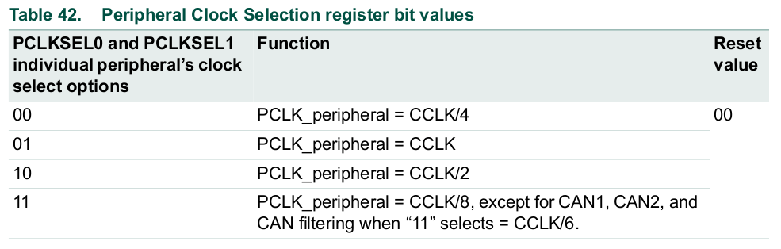
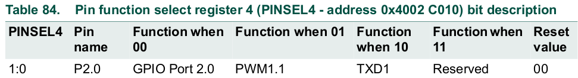

# PWM: digital output with analogue possibilities

The PWM (Pulse Width Modulator) output allows various functions: from the modulation of signals for communications to the power management of LEDs and electric motors. With only two voltage levels available (0V and 3.3V), thanks to the variable duration of the upper and lower parts of the output, the PWM functional block is able to regulate the power supplied from a minimum of 0% to a maximum of 100%, with extreme flexibility.

## PWM technique and its applications
Pulse Width Modulation is a technique that allows the generation of pulses having all the same amplitude but with programmable duration, from a minimum to a predetermined maximum. The uses of PWM are many, from adjusting the light intensity of an LED to adjusting the rotation speed of an electric motor. Here we will refer to the application with LED because it is easy to realize with the available components.
### On/Off management of an LED
From the theory we know that to be turned on an LED must be powered with a voltage higher than the threshold voltage and connected in series to a current limiting resistor; we also know that the light intensity of the LED is proportional to the intensity of the current passing through it. Note the threshold voltage VD and the supply voltage VCC, we can adjust the intensity of the current ILED (and therefore the brightness) with the RLED series resistor sized with the following formula:

  

If the VCC power is supplied by a digital output of the microcontroller (3.3V) then we can only turn on the LED with a preset intensity.
### PWM management of an LED
To modify the luminous intensity of the LED, adjusting it between the maximum value (corresponding to the ILED of the previous formula) and zero, we can apply a square wave with a fixed amplitude (3.3V) and variable duty-cycle; the duty-cycle is the ratio between the duration of the high voltage level and the repetition period of the square wave. In the following figure we see three examples of duty-cycle: at 10%, at 50% and at 90%.

  

In this way the LED will turn on at certain times (high voltage level) and will turn off at others (low voltage level). If the alternation of switch-off and switch-on instants is fast enough, our eye will perceive an average light intensity between maximum and minimum, proportional to the duty-cycle. Ultimately, to apply the PWM technique it is necessary to set a signal repetition period and a time interval within this period during which the signal is at the high logic level (the low one derives from it by difference).
## Description of the PWM block of LPC1769
### Basic configuration
#### PWM block power supply
To activate the PWM block it must be powered by setting bit6 of the PCONP register to 1 (0x400FC0C4)

  

Picture red note translation: *setting this bit to 1 powers the PWM block*.

We note that the default setting (value at the microcontroller Reset) already provides power to the PWM block.

  

#### PWM block clock
L'impostazione successiva riguarda la frequenza di clock utilizzata dal PWM. Questa può essere selezionata grazie al registro PCLKSEL0 (0x400FC1A8)

  

by setting PCLK_PWM1 (bit 13:12) to the desired value according to the following table:

  

At Reset (default value 00) the peripheral receives a clock with a frequency equal to 1/4 that of the CPU (CCLK / 4). Since in our case CCLK = 96MHz the PWM will receive a clock equal to: 96MHz / 4 = 24MHz.
#### PWM block output pin selection
To assign an output pin to the PWM block we need to use the PINSEL registers. If, for example, we want to activate the PWM1.1 output (channel 1 of PWM1) on pin P2.0 then it is necessary to set bits 1: 0 of register PINSEL4 (0x4002C010) to the value 01.

  

We note that, unlike the previous settings, this is necessary since the default value (00) provides for the GPIO functionality on P2.0 and not that of PWM1.1.
#### Interrupt management of the PWM block
During the PWM counting phase it is possible to define particular actions based on the occurrence or otherwise of certain logical conditions. These conditions are obtained for our purposes with the bits of the PWM1MCR register (0x40018014). In particular, we will use the counting restart function when the value loaded in MR0 is reached by setting bit1 (PWMMR0R) in register PWM1MCR to 1, thus obtaining a periodic signal of MR0 period.

  

