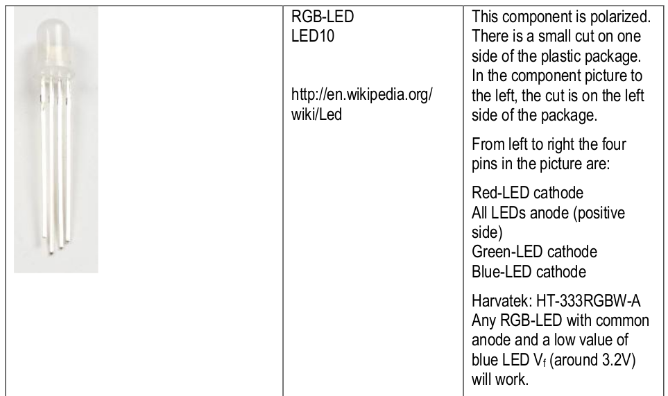
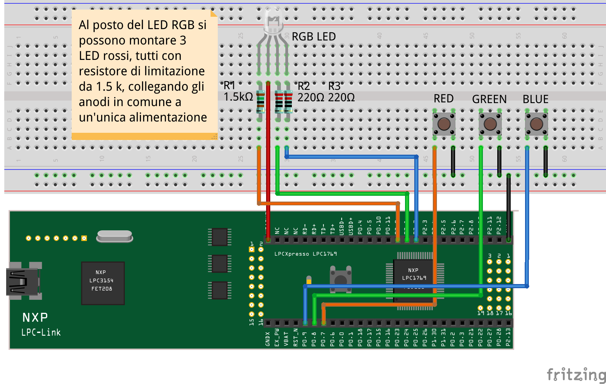
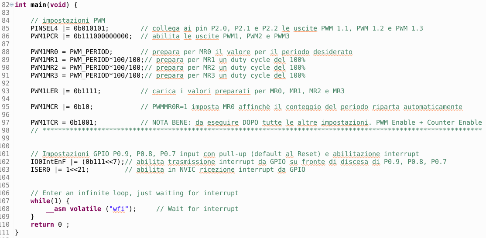
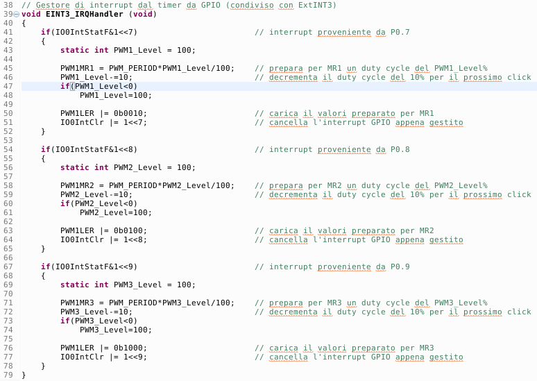

# PWM color LED driving
With this experience, students learn to manage an RGB-type color LED using the PWM control to adjust the intensity of the colors, thus modifying the resulting hue.
## Introduction
An RGB type color LED is basically the union of 3 different colored LEDs: red, green and blue. The driving of the single colors is realized with the PWM outputs of the microcontroller; in this way we can control the luminous intensity of the component colors and thus adjust the overall resulting color.
## The RGB LED
The component used in the experience is shown in the following figure:

  

The shorter lead (flat side of the LED head) corresponds to the cathode of the red color; common anode, green cathode and blue cathode follow.
## The PWM (Pulse Width Modulator) peripheral
The PWM can realize square waves with duty-cycle (ratio between the high part of the signal and the repetition period) adjustable from 0% to 100%. Given the type of mounting chosen (common anode of the RGB LED to + VDD) the colors of the LED will turn on during the low part of the signal and will turn off during the high part (logic negated).
More information on the PWM functional block is available on the dedicated page: [*PWM: digital output with analogue possibilities*](PWM_block.md)
## Used material
+ Development board for LPC1769 with expansion connectors
+ USB cable for connection to PC
+ Development station with MCUXpresso
+ Software project lpc1769_PWM
+ 1 breadboard
+ 1 RGB LED
+ 1 x 1.5kΩ limiting resistor, 2 x 220Ω limiting resistors
+ 3 buttons
+ connection cables for breadboard
## Assembly diagram
The circuit assembly diagram is shown below:

  

Translation of the picture note: *In place of the RGB LED, 3 red LEDs can be mounted, all with 1.5 kΩ limiting resistor, by connecting the common anodes to a single power supply.*

## Software analysis
As for the software, the parts relating to the PWM setting will be highlighted.
### *main()* function
Among the initial settings we find those of PWM:

  

The first three PWM channels are activated by setting them to the initial value of 100%; in this way the three RGB colors are turned off. Note that the PWM refresh period is set to 50Hz to avoid flickering in the lighting. The other initial setting concerns the three buttons connected to P0.7, P0.8 and P0.9 for which the interrupt function is also activated.
### *EINT3_IRQHandler()* interrupt handler
The function manages the inputs on the three buttons (one for each color of the RGB LED), intercepting the falling edges of the input signals:

  

For each input the current duty-cycle is updated from 100% (color off) to 0% (color at maximum intensity) in 10% steps. Therefore, with each click on a button, the relative color changes from minimum to maximum intensity, in 10% increments. It should be noted that the apparent variation (perceived by the eye) of the intensity of the colors does not always appear linear due to the response of the human eye.
