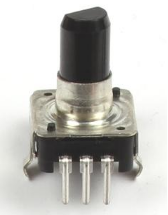
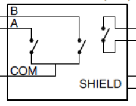
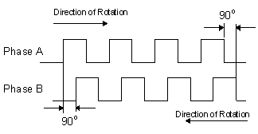
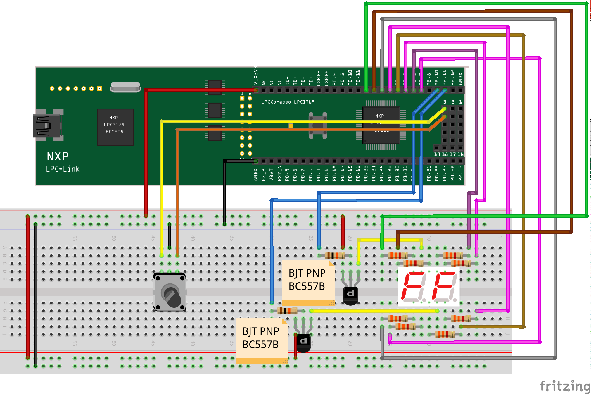
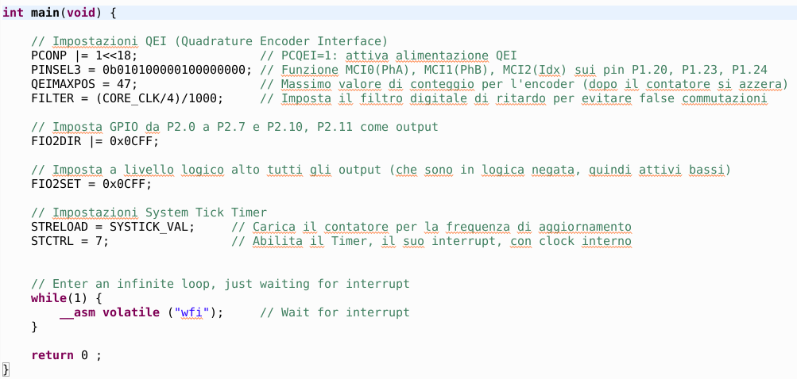

# Rotary encoder
In this experience the rotary encoder (rotary switch) is used to study the operation of the QEI (Quadrature Encoder Interface) present in the LPC1769 microcontroller. The project provides for the reuse of what is already known from the [*7-segment display management*](../lpc1769_7seg) for the data display section.
## Introduction
The project involves the use of the rotary encoder to study the QEI interface of the microcontroller. The rotation of the encoder will be presented in real time on the 7-segment display. As regards the presentation of the data, please refer to what has already been seen in the [*7-segment display management*](../lpc1769_7seg) project.
## The QEI (Quadrature Encoder Interface)
The QEI interface present inside the LPC1769 microcontroller allows the management of a quadrature encoder (usually optical type), a device external to the micro that works as a position and speed transducer as well as direction thanks to the decoding of two signals in phase quadrature. Often this type of transducer is used to accurately control electric motors. The QEI interface automatically manages the count of the impulses generated by the encoder with the possibility of setting alarm thresholds when certain positions are reached.
## The rotary encoder
 The development kit provides a switch-based rotary encoder that allows quadrature signal generation. The complete rotation of the encoder occurs through 24 clicks. The encoder wiring diagram shows us the presence of three internal switches: two for signals A and B (generated during the rotation of the selector) and an additional switch activated by pressing the selector. In this tutorial we will use only signals A and B, postponing the management of the additional switch for future experiences.

 Given the internal electrical configuration of the encoder we can hypothesize the connection to ground of the COM pin (common reference to the two switches) and the connection of channels A and B to the respective inputs of the QEI interface, equipped with internal pull-ups. The presence of the internal pull-ups guarantees, during the rotation of the selector, the generation of signals similar to those shown in the following figure:

  

As can be seen from the image, the two signals are out of phase with each other by 90 ° (ie by a quarter of a period); we note that by turning the selector in one direction, signal A will precede signal B, while by turning the selector in the reverse direction, signal B will precede signal A. This will make it possible to count the impulses up or down, according to the direction of rotation.

## Mount on breadboard
The following figure shows what is needed to carry out the experiment on breadboard:

  

Note that the input pins of the QEI interface are shown on the pads present between the two 27-pin connectors, namely PAD3 (P1 [20]) and PAD6 (P1 [23]) of the development board. These PADs must be equipped with suitably welded connectors in order to make the connection with the wires supplied in the kit. The rotary switch features a side with three pins (channels A, B and COM) and a side with two pins (unused in this experience). It is advisable to slightly bend the lateral metal supports of the rotary switch to allow the correct insertion of the pins in the breadboard. As regards the data display section, the assembly follows what has already been seen in the [*7-segment display management*](../lpc1769_7seg) project.

## Firmware di gestione
In the following lines we will analyze the specific software parts for the management of the QEI interface, highlighting only the differences compared to what has already been seen for the [*7-segment display management*](../lpc1769_7seg). The firmware project can be downloaded from this same repository.
### main() function
In the following image we see the content of the main() function:

  

The part that interests us is represented by the first lines in which we set the properties of the QEI interface. In particular, this must be powered with the PCONP register (since it is disabled when the microcontroller is reset) and connected to the output pins by means of the PINSEL3 register. Subsequently, through the QEIMAXPOS register, the maximum count value is set at 47, thus allowing the counting of 48 different pulses (from 0 to 47).

*__Note__: the count includes 48 pulses because two electrical pulses correspond to each mechanical click of the selector. Eh ?! , thus bringing the complete rotation of 24 mechanical clicks to a total of 48 electrical pulses.*

Finally, through the FILTER register, a digital filter is set to eliminate any disturbances on signals A and B; this filter consists of a delay on the reading of the input channels equal to 1ms.
