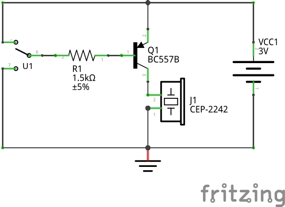
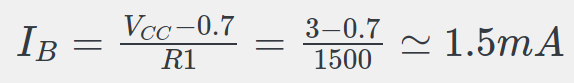
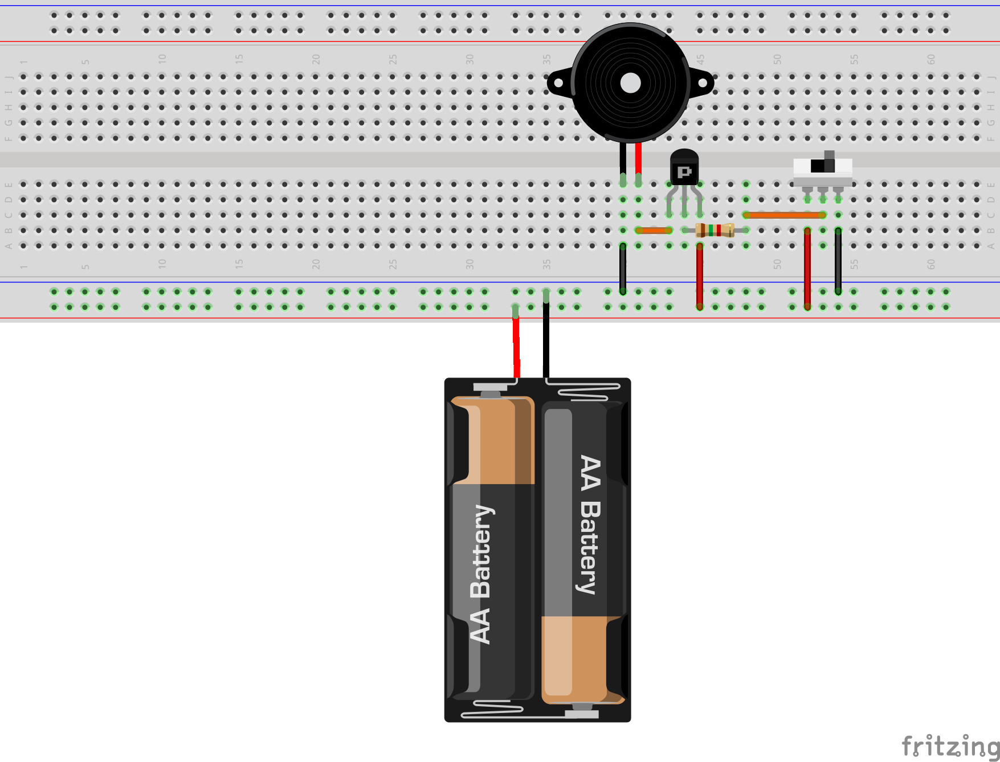
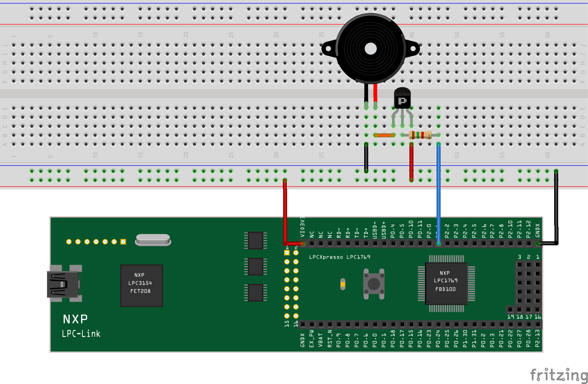
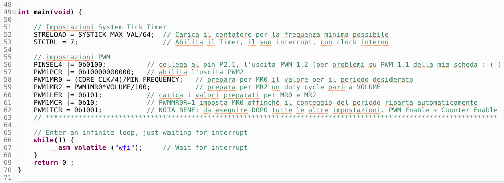
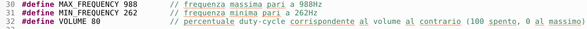
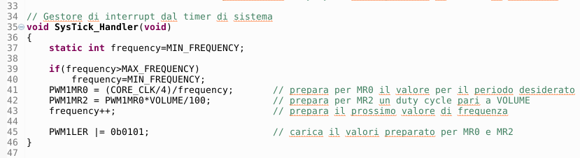

# Overview
The project realizes the driving of a [*CEP-2242*](cep-2242.pdf) buzzer by means of a *PWM* signal. In this mode it is possible to manage both the volume of the sound (by acting on the *duty-cycle*) and on the frequency of the sound (by modifying the period). The buzzer is controlled by a PNP [*BC557B*](BC556.pdf) type BJT, supplied in the *Embedded Artists* development kit. Use of the BJT avoids requiring excessive current from the microcontroller port.
## Test wiring diagram
In the following drawing we report the wiring diagram of the buzzer driven by the transistor in turn controlled by a switch able to supply 0V or 3V to its base.

  

When the diverter is moved upwards (3V) a voltage equal to that on the emitter arrives at the base of the transistor (also connected directly to 3V): in this way the voltage vBE is equal to zero, the transistor is disabled and does not let the current pass through the buzzer which is therefore off. Moving the diverter downwards (0V) a potential difference is created between the base and the emitter which settles around -0.7V ÷ -0.8V: the transistor goes into conduction supplying current to the buzzer which begins to sound. Resistor R1 serves to limit the base current to a value of approximately:

  

Note that the current has a positive direction from the base towards the diverter (*PNP* type *BJT*).

The proposed circuit allows you to test the buzzer without the development board of the microcontroller, also giving the possibility to measure the currents and voltages involved.
## Test assembly plan
The circuit test assembly layout is shown in the following drawing:

  

To replace the two 1.5V batteries, we can connect an external 3V regulated power supply or use the development board which provides a voltage of about 3.3V.

Now try to measure the collector current and the base current when the buzzer sounds. Would it have been prudent to connect the buzzer directly to the microcontroller, eliminating the BJT?
## Complete assembly plan
The complete circuit used for the demonstration involves the use of the development board for *LPC1769* connected to the external breadboard, according to the assembly diagram shown in the following figure:

  

We note that in this case the power supply is supplied by the development board while the command on the base comes from the *PWM1.2* signal present on *pin J6-43* of the expansion connector. The choice of *PWM1.2* was forced due to a corruption of the *PWM1.1* channel of my development board.
## Software analysis
The C language project for MCUxpresso is contained in this same repository.

The logic of the program foresees the setting of the *PWM* with variable period, from a maximum value to a minimum value, corresponding respectively to a variable sound frequency from a minimum to a maximum. The *duty-cycle* is adjusted as volume, bearing in mind that we operate in an inverted logic (thanks to the *PNP BJT*), so with low *duty-cycle* the volume is high while with high *duty-cycle* the volume is low. The rate of change of the *PWM* period (and therefore the frequency of the sound) is regulated by a system timer (*SYSTICK timer*).
### Initial Settings
In the start part of the program the *SYSTICK timer* is set, loading the *STRELOAD* register with *SYSTICK_MAX_VAL* (*0xFFFFFF*) divided by a value found experimentally to obtain an alarm-like sound.

  

Then there are the settings to enable *PWM*, with period corresponding to the minimum sound frequency (*262Hz*) and *duty-cyle* equal to *VOLUME* (*80%*).

  

We use a high *duty cycle* to avoid distortion in the sound. The channel used is *PWM1.2* and not *PWM1.1* due to a fault on my personal development board.

We note that whenever we set the main period of the *PWM* with *MR0* (sound frequency) we must also modify *MR2* to keep the constant *duty cycle* (sound intensity).

After the initial settings the infinite *while* loop starts, with processor waiting for *interrupt*.
### *SYSTICK timer* interrupt service routine

  

When the *SYSTICK timer interrupt* is triggered, the program jumps into the service routine and modifies the sound frequency value by acting on the *MR0* register of the *PWM*. Once again we remind you that the *MR2* register must always be updated to keep the *duty-cycle* constant. The frequency variation ranges from a minimum value (*262Hz*) to a maximum value (*988Hz*), in *1Hz* increments each time the *SYSTICK timer* is triggered. When the maximum frequency is reached, it returns to the minimum value, and then the increase cycle starts again.
## And now let's experiment
+ Now try to modify the project to use the *PWM1.1* channel as a command for the *BJT* base. Remember that the simple changes required are both hardware and software.
+ What happens if we change the frequency range?
+ What happens if we change the volume?
+ What happens if we change the speed of the *SISTICK timer*?
+ Could you rewrite the *interrupt* handler to generate a completely different sound?
+ What changes in the circuit and in the software if we replace the *BJT PNP* with an *NPN* type (eg [*P2N2222A*](P2N2222A-D.pdf))?
