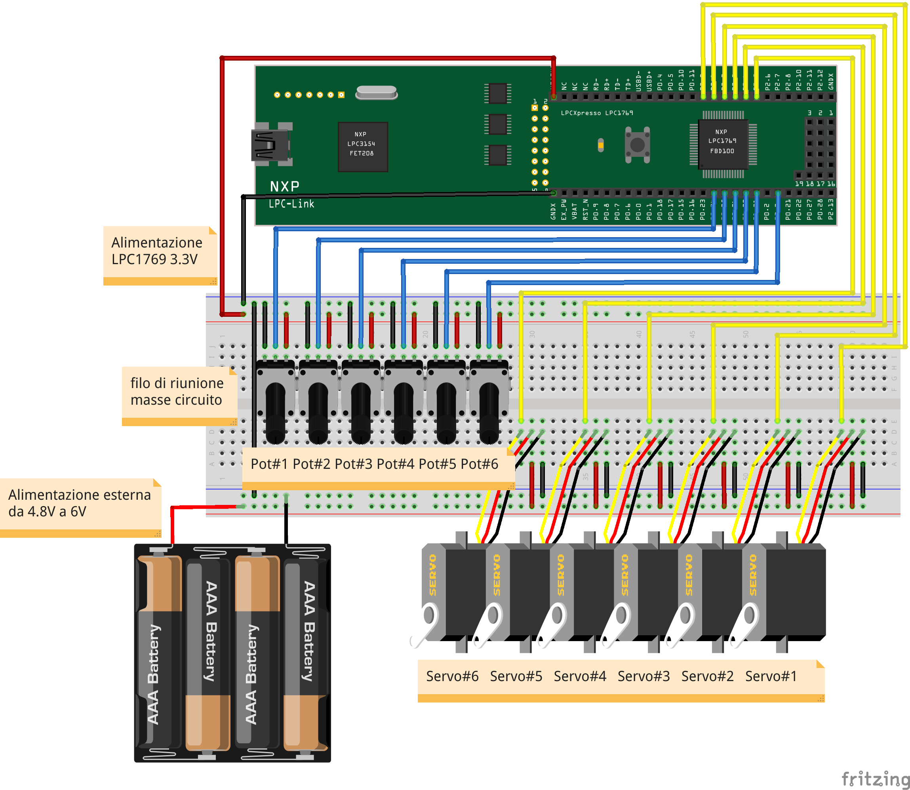
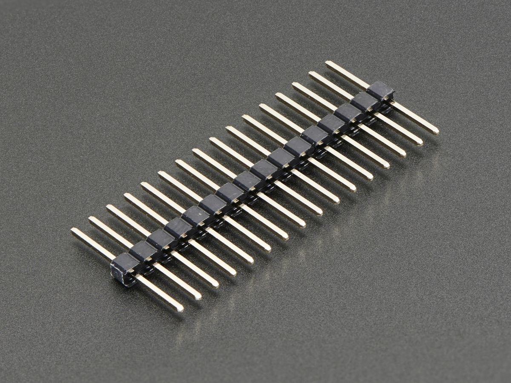

# Manual control of servomotors
## Introduction
Servomotors are intelligent actuators capable of maintaining a position controlled by a *PWM* type input signal. For a first approach to the topic you can refer to the page [*Servomotor test project*](../lpc1769_servo).
## General system architecture
The project provides for the manual control of 6 servomotors with an *LPC1769* development board, by means of 6 *PWM* channels. The desired position of the servomotors is adjusted thanks to 6 potentiometers, one for each servomotor. In this way, by mounting the servomotors on a mechanical structure such as an artificial arm, an operator can control the position of the same with 6 degrees of freedom; by alternating different positions of the motors, the operator can make the mechanical arm perform a series of simple movements.
This system represents a first step towards the development of a fully automated arm, capable of replicating more or less complex trajectories recorded during a learning period under the guidance of an external operator.
## Assembly plan
The complete circuit is presented in the following image. It should be noted that the power supply of the servomotors, shown as a pack of 4 AAA batteries in series, can obviously be obtained from a bench generator, set between 4.8V and 6V. The power supply of the microcontroller board is connected to the same reference of the power supply for the motors by means of a black cable for joining the grounds.

  

### Adjustment section
The ends of the servo motor control potentiometers are connected one to the microcontroller power supply (3.3V) and the other to the ground of the development board. The central pins of potentiometers *Pot#1* to *Pot#6* are connected to the input channels of the microcontroller's 12bit integrated analog to digital converter (A/D). Note that the converter channels *AD0.1* to *AD06* are used, corresponding to pins *P0[24], P0[25], P0[26], P1[30], P1[31]* and *P0[3]*.
### Control section
The servomotors are powered by a separate constant voltage generator between 4.8V and 6V. To simplify the assembly of the 3-wire connectors (yellow, red, black) of the servomotors, a row of 18 pins (3 pins x 6 servomotors) similar to the one shown in the figure can be used.

  

By inserting the connector vertically into the breadboard, a simple assembly of the servomotor connectors is then carried out, placing them side by side. The jumper connections are then made on the breadboard for the power supply and the ground of the individual servomotors (red and black cable) to the longitudinal lines connected to the external power supply. Finally, the connections of the commands are made by means of yellow cables that connect respectively the servomotors from *Servo#1* to *Servo#6* to the *PWM* channels which go from *PWM1.1 (P2[0])* to *PWM1.6 (P2[5])*.
