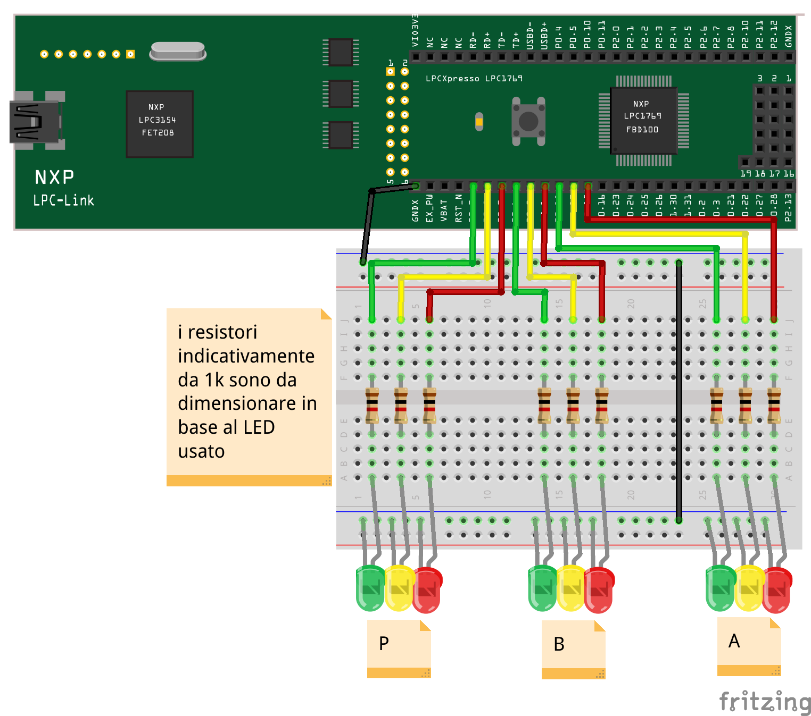
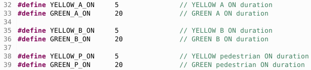
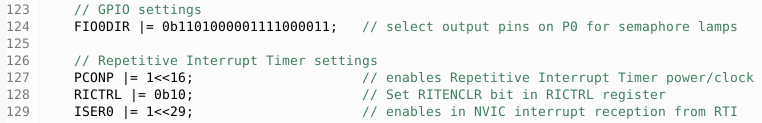
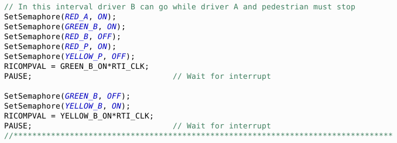
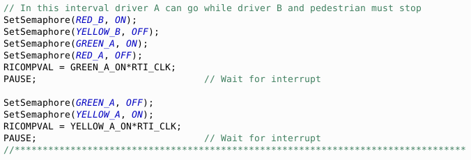
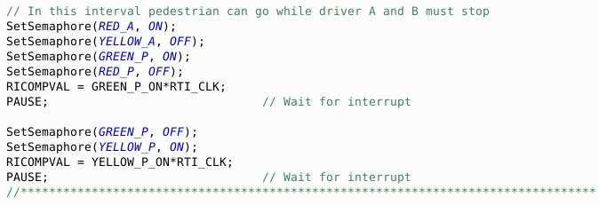

# A general look
The project presented here simulates the management of a traffic light intersection with three times: time A for vehicles in one direction, time B for vehicles in the other direction and time P dedicated to pedestrians.
## The assembly plan
The circuit used for the demonstration involves the use of the development board for LPC1769 and an external breadboard with 9 LEDs dedicated to the three user streams of the intersection, according to the assembly diagram shown in the following figure.

  

*Yellow note translation: approximately 1k resistors must be sized according to the LED used*

The groups of LEDs should clearly be duplicated on the sides of the intersection but the management program remains identical. The project code for LPC1769 is reported in this same repository.
## Software analysis
The fixed sequence allows the passage in sequence of the three flows, with the possibility of acting on the times during compilation by modifying the #define at the top of the *lpc1769.c file*, as shown in the following image:

  

The values are expressed in seconds and can be chosen individually.
## The initial settings
The *RIT (Repetitive Interrupt Timer)* is used for timing, the documentation of which is presented in chapter 22 of the [*User Manual*](https://www.nxp.com/docs/en/user-guide/UM10360.pdf), while 9 *GPIO* pins adjusted in output are used for driving the LEDs. The initial settings are shown in the following image:

  

In the infinite *while* loop, the three crossing management times follow one another.
## Time B
In this time interval the vehicles of flow B can pass while those of flow A and pedestrians have to wait. The range is divided into two sub-ranges, one with green for B and the other with yellow:

  

By invoking the *SetSemaphore(semaphore_lamps lamp, lamp_status status)* function it is possible to select the status of each single LED. These are identified with an enumerated type value *semaphore_lamps {RED_A, YELLOW_A, GREEN_A, RED_B, YELLOW_B, GREEN_B, RED_P, YELLOW_P, GREEN_P}* while the two possible on/off states are indicated with the enumerated type *lamp_status {ON, OFF}*.

We note that at the end of the correct setting of the lights the timer delay time is loaded and the processor pause (*__asm volatile ("wfi")*) is commanded until the next awakening due to the interruption of the timer.
## Time A
In this time interval the vehicles of flow A can pass while those of flow B and pedestrians have to wait. The range is divided into two sub-ranges, one with green for A and the other with yellow:

  

## Time P
In this time interval pedestrians can pass while the vehicles of both flow A and B have to wait. The range is divided into two sub-ranges, one with green for pedestrians and the other with yellow:

  

