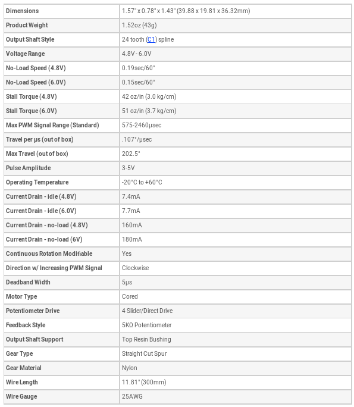

# Servomotor test
## Introduction
Servomotors are extremely simple actuation devices to use and this has facilitated their diffusion in the hobby world of radio models (cars, boats, airplanes). As the name suggests, servomotors are real control systems, with an electric motor, a position transducer and control and drive electronics integrated in a single device. To make them work, just power them up and provide them with an appropriate PWM signal so that they move to a well-defined position, maintaining it as long as the same type of command remains.

The current design provides a servomotor test, with a simple slow clockwise rotation and subsequent fast return to the starting position, with repetition of the motion indefinitely.
## Hitec HS-311 Servomotor
The Hitec servo motor brand is among the most widespread on the market; the type used is documented on the relevant [*manufacturer page*](http://hitecrcd.com/products/servos/analog/sport-2/hs-311/product). Other general information is available in the [*Servomanual.pdf*](Servomanual.pdf) document and on this [*website*](https://www.servocity.com/hs-311-servo), of which we report an extract in the form of a table:

  

We note in particular that the command provides for an impulse that goes from a minimum duration of 575μs (initial position) to a maximum of 2460μs (final position).
## Assembly plan
The servomotor wiring has 3 different colored wires: red and black for power supply (between 4.8V and 6V) and yellow for PWM control (with amplitude between 3V and 5V). Power to the servo is provided by an external generator; the figure shows a group of 4 AA batteries in series, for a total voltage ranging from 4.8V for rechargeable batteries to a maximum of 6V for alkaline batteries. Obviously we can obtain a similar result with a bench power supply or by reusing an old telephone charger with a suitable power outlet.
