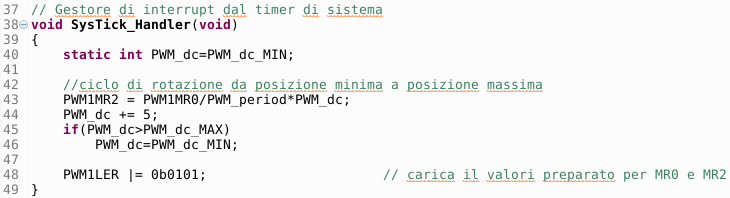

# Servomotor test
## Introduction
Servomotors are extremely simple actuation devices to use and this has facilitated their diffusion in the hobby world of radio models (cars, boats, airplanes). As the name suggests, servomotors are real control systems, with an electric motor, a position transducer and control and drive electronics integrated in a single device. To make them work, you just need to power them up and provide them with an appropriate PWM signal so that they move to a well-defined position, maintaining it as long as the same type of command remains.

The current design provides a servomotor test, with a simple slow clockwise rotation and subsequent fast return to the starting position, with repetition of the motion indefinitely.
## Hitec HS-311 Servomotor
The Hitec servo motor brand is among the most widespread on the market; the type used is documented on the relevant [*manufacturer page*](http://hitecrcd.com/products/servos/analog/sport-2/hs-311/product). Other general information is available in the [*Servomanual.pdf*](Servomanual.pdf) document and on this [*website*](https://www.servocity.com/hs-311-servo), of which we report an extract in the form of a table:

  

We note, in particular, that the command provides for an impulse that goes from a minimum duration of 575μs (initial position) to a maximum of 2460μs (final position).
## Assembly plan
The servomotor wiring has 3 different colored wires: red and black for power supply (between 4.8V and 6V) and yellow for PWM control (with amplitude between 3V and 5V). Power to the servo is provided by an external generator; the figure shows a group of 4 AA batteries in series, for a total voltage ranging from 4.8V for rechargeable batteries to a maximum of 6V for alkaline batteries. Obviously we can obtain a similar result with a bench power supply or by reusing an old telephone charger with a suitable power outlet.

  

We note that it is necessary to combine the mass of the development board for LPC1769 with the mass of the external power supply on a breadboard.
## Software
The following figure shows the *main()* function of the project that can be downloaded from this same repository.

  

The control channel used is *PWM1.2* for the well-known problem that occurred to my development board. The *PWM1MR0* register (which determines the *PWM* period) is loaded with the value corresponding to 20ms (1/50 of a second); the *PWM1MR2* register is preloaded with the value corresponding to the minimum duty-cyle (575μs) to bring the servomotor to the initial position.

In the *main()* function, the *Systick Timer* is also set to set the speed of change of the servomotor position.

The following figure shows the *Systick Timer* interrupt handler code:

  

Each time the timer is triggered, the duration of the *PWM* pulse is changed, from the minimum value (initial position) to the maximum value (final position), with an increase of 5μs. Once the maximum value is reached, it returns directly to the minimum value.
## Possible developments
+ Change the software to make the movement slow in both clockwise and counterclockwise directions.
+ Modify the software to control the servomotor in 3 predefined positions: start, middle and end.
+ Create an additional circuit that includes three LEDs of different colors, so that the green LED lights up in the initial position, the yellow LED in the central position and the red LED in the final position.
+ Create an additional circuit that includes an external input (potentiometer type) to control the motor in a desired position.
