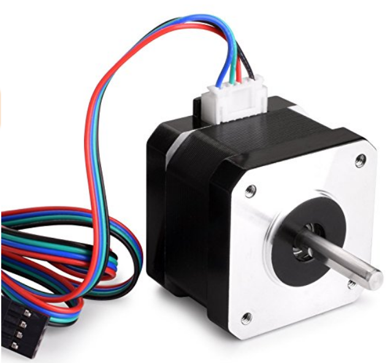
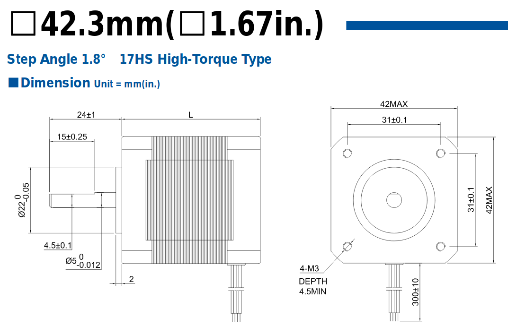
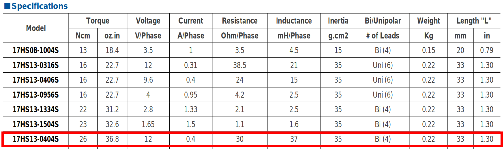
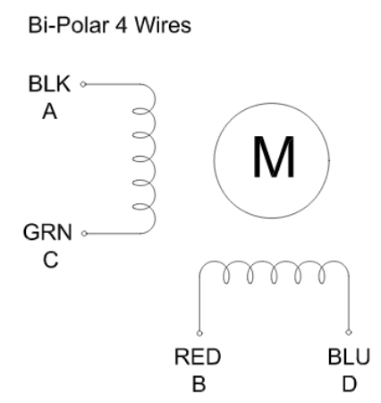
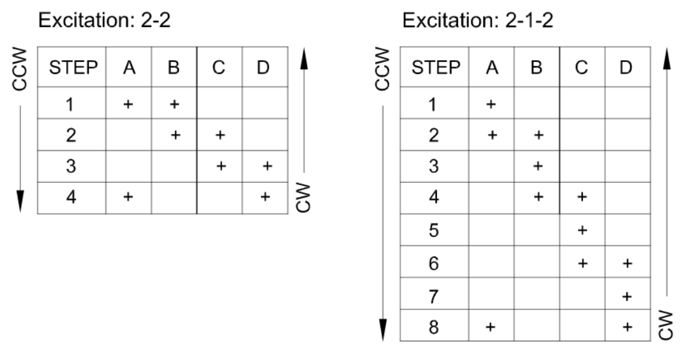
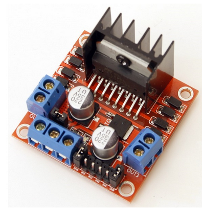

# Constant speed stepper motor
## Introduction
Stepper motors are motors with discretized stepping motion. For their control it is necessary to use square wave signals suitably out of phase with each other. During the generation of the phase sequence, the motor executes the steps and stops when the sequence ends, maintaining the position with a certain resisting torque (determined by the size of the motor and by the current present in its windings). To power the motor it is necessary to use a power driver (in our case the L298 device) since the current to be supplied to the windings exceeds the output capacity of the microcontroller pins.
## Nema 17HS13-0404S motor
The stepper motor used is of the Nema 17HS13-0404S type  , bipolar with 12V power supply and a working current of 0.4A. The datasheet of this type of motor can be downloaded (for example) from the [*Osmtec*](http://www.osmtec.com/nema_17_step_motor_17_hs.htm) company link or directly from the [*local copy in pdf format*](17hs.pdf) on this site.

The dimensional characteristics of the motor are briefly summarized in the figure below:

  

In particular we note that the motor has a step angle of 1.8 ° which means that for a complete rotation the motor must take 200 steps (360 ° / 1.8 °) in full-step mode.

The data of the motor in question are shown in the following image (last row of the table):

  

The power supply voltage (12V) and current data for each phase (0.4A) should be noted. The resistance of each phase is 30 Ohm (12V / 0.4A). The motor is of the bipolar type and therefore has 4 connection wires, as shown in the following figure:

  

On the datasheet we also find the driving sequence for the full-step and half-step modes (following image):

  

We note that in the firmware project the motor phases will be named A +, A-, B +, B- with A- corresponding to C and B- corresponding to D. In this way we will indicate for the first winding a positive terminal A + and a negative A- and for the second winding a positive terminal B + and a negative terminal B-.

## L298 power driver

 A module based on the L298 integrated circuit was used for the power driver. The characteristics of the module (very widespread) can be found for example on the [*RobotStore*](https://www.robotstore.it/Controllo-motori-con-driver-L298N-per-motori-DC-e-motori-passo-passo) website while the integrated datasheet is available on the manufacturer's website (ST Microelectronics) at the following address: L298

The module is also supplied with a 5V voltage regulator useful for powering the board with microcontroller. It should be noted that this regulator can be used only if the general power supply voltage of the module is contained within 12V. Remember that the power dissipated by the 5V linear regulator is equal to the difference between its input voltage (12V) and output voltage (5V) multiplied by the current supplied. Assuming an absorbed current of 100mA for the development board for LPC1769, we have a dissipated power on the regulator equal to:
