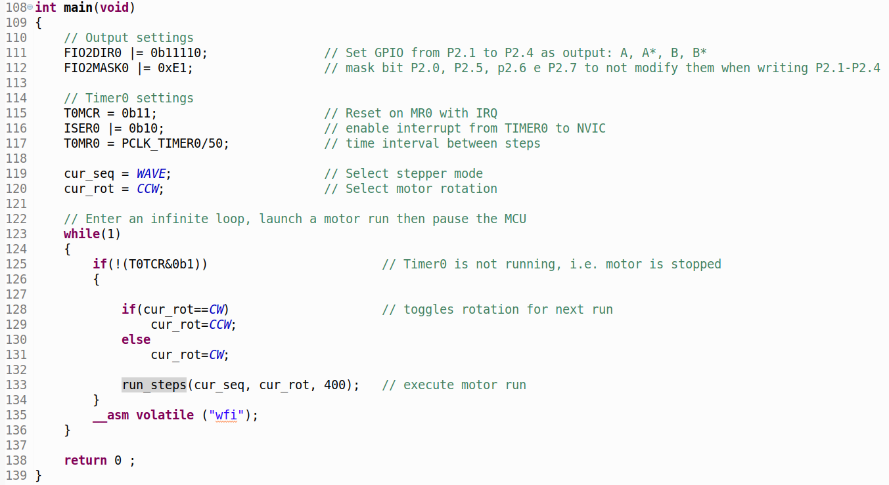

# Constant speed stepper motor
## Introduction
Stepper motors are motors with discretized stepping motion. For their control it is necessary to use square wave signals suitably out of phase with each other. During the generation of the phase sequence, the motor executes the steps and stops when the sequence ends, maintaining the position with a certain resisting torque (determined by the size of the motor and by the current present in its windings). To power the motor it is necessary to use a power driver (in our case the L298 device) since the current to be supplied to the windings exceeds the output capacity of the microcontroller pins.
## Nema 17HS13-0404S motor
The stepper motor used is of the ***Nema 17HS13-0404S*** type, bipolar with 12V power supply and a working current of 0.4A. The datasheet of this type of motor can be downloaded (for example) from the [*Osmtec*](http://www.osmtec.com/nema_17_step_motor_17_hs.htm) company link or directly from the [*local copy in pdf format*](17hs.pdf) on this site.

The dimensional characteristics of the motor are briefly summarized in the figure below:

  

In particular we note that the motor has a step angle of 1.8 ° which means that for a complete rotation the motor must take 200 steps (360°/1.8°) in *full-step* mode.

The data of the motor in question are shown in the following image (last row of the table):

  

The power supply voltage (12V) and current data for each phase (0.4A) should be noted. The resistance of each phase is 30 Ohm (12V/0.4A). The motor is of the bipolar type and therefore has 4 connection wires, as shown in the following figure:

  

On the datasheet we also find the driving sequence for the *full-step* and *half-step* modes (following image):

  

We note that in the firmware project the motor phases will be named A +, A-, B +, B- with A- corresponding to C and B- corresponding to D. In this way we will indicate for the first winding a positive terminal A + and a negative A- and for the second winding a positive terminal B + and a negative terminal B-.

## L298 power driver

 A module based on the L298 integrated circuit was used for the power driver. The characteristics of the module (very widespread) can be found for example on the [*RobotStore*](https://www.robotstore.it/Controllo-motori-con-driver-L298N-per-motori-DC-e-motori-passo-passo) website while the integrated datasheet is available on the manufacturer's website (ST Microelectronics) at the following address: [*L298*](https://www.st.com/en/motor-drivers/l298.html)

The module is also supplied with a 5V voltage regulator useful for powering the board with microcontroller. It should be noted that this regulator can be used only if the general power supply voltage of the module is contained within 12V. Remember that the power dissipated by the 5V linear regulator is equal to the difference between its input voltage (12V) and output voltage (5V) multiplied by the current supplied. Assuming an absorbed current of 100mA for the development board for LPC1769, we have a dissipated power on the regulator equal to:

  

We note that the 5V regulator has the cooling fin directly welded on the small printed circuit, with consequent limited possibility of dissipation.

From the following figure we can derive the connections to be made to connect the module to the stepper motor and the microcontroller.

  

*Image legend translation: 1. "+" connector for DC motor A or "A +" for stepper motor
    2. "-" connector for DC motor A or "A-" for stepper motor
    3. 12V jumper - remove the jumper if you are using a power supply voltage higher than 12V; this enables the 5V voltage regulator
    4. Motor power supply connector (max 35V) - remove the 12V jumper (# 3) if the voltage is> 12V
    5. GND
    6. 5V output if the 12V jumper is in position; suitable for powering an Arduino board
    7. Jumper for the activation of the DC motor A; keep the jumper in place if using a stepper motor. Connect to PWM output to enable DC motor speed control.
    8. IN1
    9. IN2
    10. IN3
    11. IN4
    12. Jumper for the activation of the DC motor B; keep the jumper in place if using a stepper motor; connect to PWM output to enable DC motor speed control
    13. "+" connector for DC motor B or "B +" for stepper motor
    14. "-" connector for DC motor B or "B-" for stepper motor*

In particular, phase A of the motor must be connected to pins 1-2 (A + black, A- green) while phase B must be connected to pins 13-14 (B + red, B- blue). The 12V input power supply to the module is connected to pin 4, the ground to pin 5. Pin 6 supplies the 5V voltage for the microcontroller board. Note that the mass of the microcontroller board must be combined with that of the module.

## Assembly plan
Pins 7 and 12 are connected with fixed 5V jumpers to always enable the two H bridges of the L298 integrated circuit. The four input pins 8-11 receive the phase signals from the microcontroller output pins: P2.1 to p2.4.

The overall circuit is therefore the following:

  

For those wondering why the wiring starts from P2.1 and not from P2.0, the answer is very simple: the choice was obligatory, as pin P2.0 of the development board was damaged (:confounded:).

## The firmware
The project code is in this same repository.

### The *main()* function

  

In the first instruction, pins *P2.1* to *P2.4* are set as an output to output the motor phase control signals. The second instruction sets a mask on bits *P2.0, P2.5, P2.6, P2.7*. In this way, every time we write a byte on port 2 (from *P2.0* to *P2.7*) only the NOT masked bits will change value (from *P2.1* to *P2.4*).

The following instructions concern *Timer0*. In particular we want the *reset* (zeroing) of the *Timer0* when it reaches the value loaded in the *MatchRegister* and at the same time the activation of the *interrupt*. In the next instruction, *interrupt* routing through *NVIC* is enabled. The last instruction for the *Timer0* foresees the loading of the *MatchRegister* with the expected count value for the *reset/interrupt*. In our case the value corresponds to a time interval of one 50th of a second, therefore the motor frequency will be equal to 50Hz (50 steps per second, corresponding to a time of 4 seconds for a complete rotation in *wave* and *full-step* and 8 seconds for a full rotation in *half-step*).

With the variables *cur_seq* and *cur_rot* we set the desired sequence type (in the example of the figure *WAVE*) and we record the current direction of rotation (in the example *CCW*).

At this point we have the usual infinite *while()* loop in which we check if *Timer0* is active or not (by testing bit 0 of register *T0TCR*). If *Timer0* is stopped we can reverse the rotation (from *CCW* to *CW* or vice-versa) and call the function *run_steps()* having as parameters the type of sequence, the direction of rotation and the number of steps to be performed (in the example 400, equivalent two laps in *wave* and *full-step* or one lap in *half-step*).

Immediately after the execution of the *run_steps()* function (which we will analyze in a moment) we put the *ARM* processor to sleep with the usual *wfi* (*wait for interrupt*) instruction. In this way, at the next *interrupt* (generated by *Timer0* after a 50th of a second) the processor will wake up passing to the execution of the relative *handler*.

### The *run_steps()* function

  

This function performs a preparatory work for the execution of the chosen sequence. As the first instruction, it saves the total number of steps to be performed in the global variable *total_steps*. Subsequently, by means of a *switch* instruction, the desired sequence is selected by addressing the global pointer *seq_ptr* to one of the three vectors in which the sequences of values for the signals A +, A-, B + and B- have been described (see the following figure):

  

For those who have noticed the 0 present in the least significant position in the values ​​of all the sequences, remember that the command bits are sent to pins *P2.1-P2.4* (again because pin *P2.0* of the development board is damaged). We also note that the *wave* and *full-step* sequences take 4 different words while the *half-step* sequence takes 8.

At the same time, the length of the selected sequence is entered in the global variable *seq_len*.

At the end of this preparatory work, *Timer0* is started. Remember that upon returning from the *run_steps()* function the program finds the *wfi* instruction that puts the processor in *standby* until the next *Timer0 interrupt* (instant in which the processor wakes up to execute the *IRQ handler* of *Timer0*)

### *Timer0 IRQ* handler

  

Inside the *IRQ* manager of the *Timer0* as the first instruction we have the assignment to the output bits *P2.1-P2.4* of the current value of the sequence in use. To correctly index the current value we use the global variable *cur_state* previously initialized to zero. In this way we start from the first position of the desired vector.

Then we select based on the value of the global variable *cur_rot* whether to increase or decrease the current state of the sequence (used as an index of the vectors). When *cur_state* reaches its upper limit (in the case of an increase) or lower (in the case of a decrease) it is brought back to the opposite limit.

In the next instruction we update the count of the steps taken by increasing the global variable *cur_step*. If we have completed the number of steps we stop and reset the *Timer0* (to block the movement of the motor), also clearing the global variable *cur_step*.

The last instruction of the *handler* code is, as always, the cancellation of the *interrupt* flag to signal that the interruption has been managed.

