# Variable speed stepper motor
## Introduction
In the previous project [*constant speed stepper motor*](https://github.com/nicola-masarone/lpc1769-projects/tree/master/lpc1769_step_motor) we have introduced a type of control by using a *Timer* for the motor steps sequence. The speed of the *Timer* has been set to a constant value, thus determining a rectangular speed profile for the stepper motor's speed. We have already concluded that having such a speed profile represents a limit, since to avoid losing steps it is necessary to limit the motor rotation speed a lot. In the following image we review the point of the *firmware* code of the previous project where we set the constant speed of the *stepper* motor:

  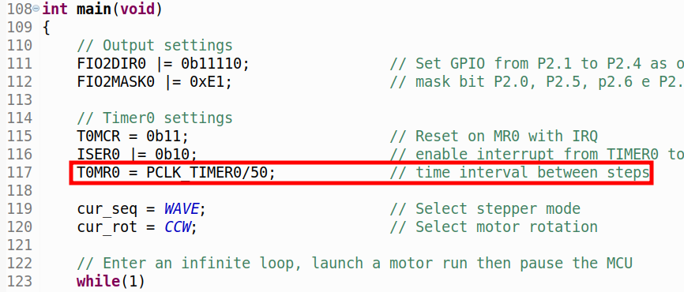

obtaining a rectangular speed profile as shown in the following figure:

  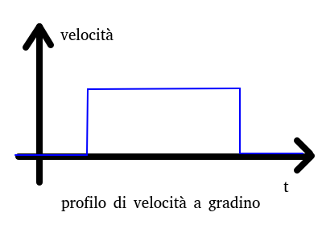

The objective of the current project is the realization of a speed profile for the trapezoidal stepper motor, with constant and predetermined acceleration and deceleration. The result we intend to obtain is represented in the following figure:

  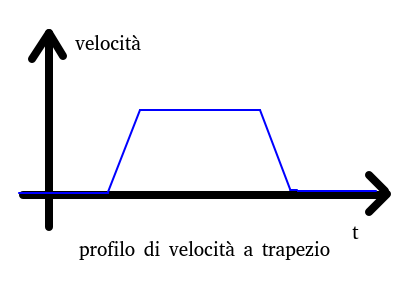

## Hardware
As for the hardware settings, refer to [*constant speed stepper motor*](https://github.com/nicola-masarone/lpc1769-projects/tree/master/lpc1769_step_motor) project, as there are no changes planned for the current project.

## Firmware
The code can be downloade from thi same repository. The modifications substantially concern a change of the value loaded in the *T0MR0* register in order to obtain a variable time interval between one step and another and, consequently, a variable motor speed. Let's look at the changes in the firmware in detail.

### *main()* function
The *main()* function code shown in the following figure has a few changes:

  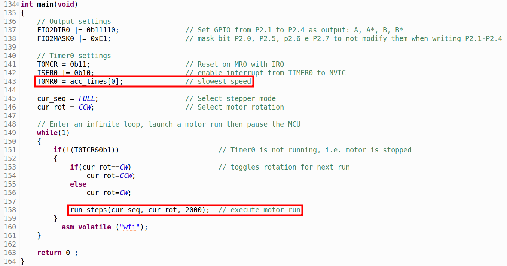

In particular we note that the initial value of register *T0MR0* is loaded with the contents of the first location of the array *acc_times[]* (array that we will know in a bit). The other, less important change concerns the amplitude of the demo movement which has been increased to 2000 steps.

### *run_steps()* function
The code of the function was modified by inserting a preamble that assigns values to three new global variables: acc_len, const_len, dec_len containing respectively the length in steps of the acceleration, of the constant speed section and of the deceleration.

  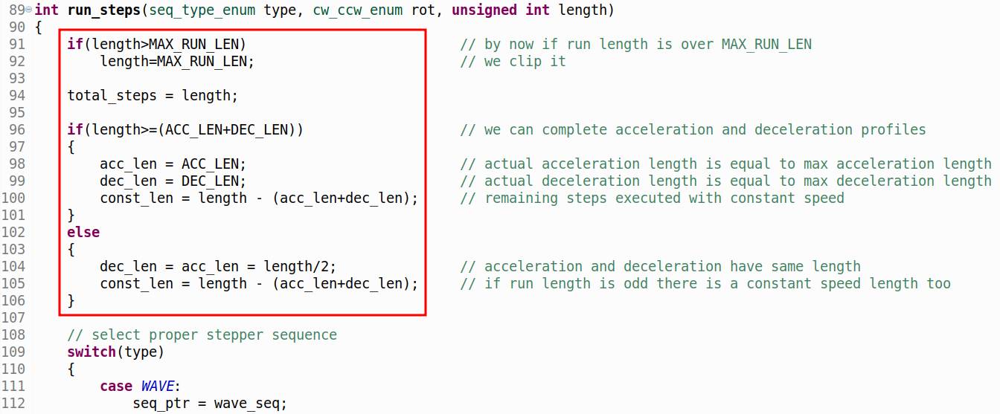

In the first *if()* structure we verify that the total length of the movement is contained within the *MAX_RUN_LEN* value (possibly limiting it).

In the second *if()* structure it is checked whether the total length of the movement is greater than the sum of the constants *ACC_LEN* and *DEC_LEN* which contain the maximum length in steps of acceleration and deceleration (equal to the length of the vector *acc_times[]*). In this case, there is an acceleration ramp with length *ACC_LEN*, a deceleration ramp equal to *DEC_LEN* and a constant length section equal to the remaining steps (net of acceleration and deceleration). If, on the other hand, the total length of the movement is less than the sum of the acceleration and deceleration ramps then there is no constant stretch (the maximum speed is not reached) and the profile will only provide acceleration and deceleration (reduced in length). In this case the trapezoidal velocity profile becomes triangular:

  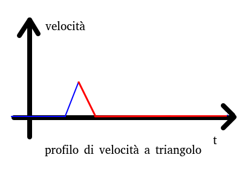

In this case, we note that, half the length of the movement is assigned to the acceleration ramp and half to the deceleration ramp; moreover, in the case of an odd total length, the extra pitch resulting from the truncation to the lower integer of the ramps is assigned to the constant speed section.

These constants are all defined in the new header file *step_times.h*:

  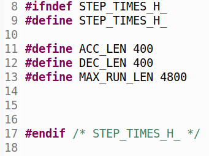

Below is the definition of the new global variables:

  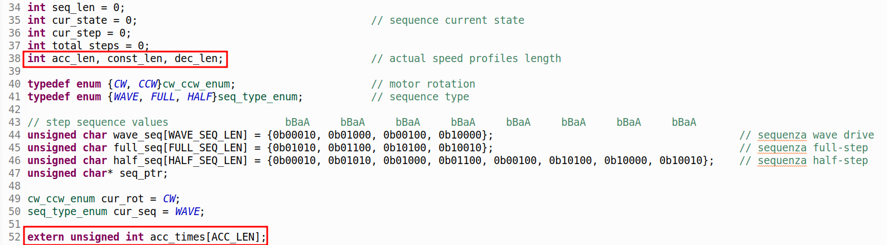

We note that the vector *acc_times[]* is declared as *extern* and therefore is defined in another file (*steps_times.c*)

### Timer0 IRQ handler
The *interrupt* handling function of *Timer0* encompasses the actual *firmware* modification to obtain a variable speed profile. The following figure highlights the part of the code that modifies the speed of the *stepper* motor:

  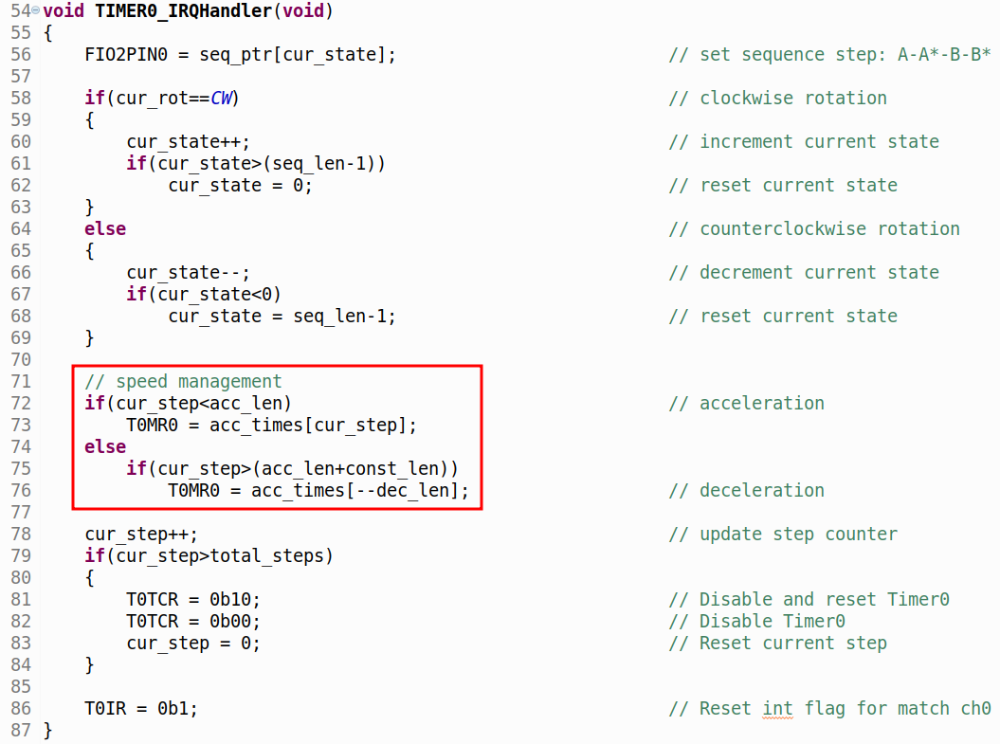

Let's analyze the *if()* structure which compares the *cur_step* counter (current step) with the value of the expected length for the acceleration (calculated in the *run_steps()* function): if *cur_step* is less than *acc_len* we are in acceleration and the *T0MR0* register is loaded the corresponding value of the vector *acc_times[]* (defined in the file *steps.c*; we refer to a later discussion on how to calculate the values present in the vector *acc_times[]*). We note that at each execution of the *handler* manager we are simultaneously executing a new step and modifying the current value of the motor speed.

In the *else* section we check with another *if()* statement if *cur_step* is greater than the sum of the acceleration phase and the constant speed phase; in this case we are in the deceleration phase and we use the same vector *acc_times[]* but read backwards (from maximum to minimum speed). We note that as an index to travel the vector backwards we use the same length of the *dec_len* deceleration, decremented by one using the prefix --.

If the previous *if()* statement is false it means that we are in the constant speed phase and the value of the *Timer0* register is not modified but left at the last value reached during the previous acceleration ramp.

### *acc_times[]* array
The vector *acc_times[]* contains in its locations the values of the register *T0MR0* corresponding to the different speeds of the *Timer0* and therefore of the *stepper* motor. This vector is defined with constant values in the *step_times.c* file:

  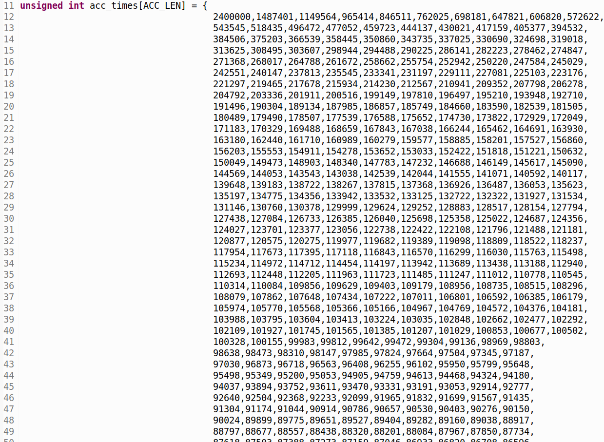

The values were obtained separately with a spreadsheet, through a procedure that we will explore later. We note however that the length of the vector has been defined equal to the constant *ACC_LEN* (400). This means that the acceleration from minimum to maximum speed (and vice-versa) is completed in 400 steps (two motor revolutions in *WAVE* or *FULL-STEP* mode or one revolution in *HALF-STEP* mode).

To modify the acceleration-deceleration profile, it is necessary to recalculate the values of the *acc_times[]* array and then recompile the *firmware* project code by rewriting it in the flash memory of the microcontroller.

### Calculation of the *acc_times[]* array
To obtain the times of the *acc_times[]* array we must first define the parameters involved in the definition of acceleration. Recall the definition of acceleration:

  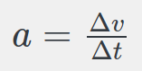

that is, the ratio between the speed variation and the time interval in which this variation occurs. In our project the motor speed is inversely proportional to the step time (loaded in *Timer0*). The previous formula can therefore be explained as:

  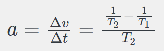

in which we pass from the old speed to the new one (from v1 to v2) in the new step time T2. With some algebraic passages we get:

  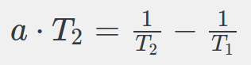

  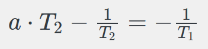

  

  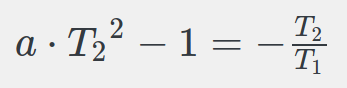

  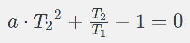

The last expression represents a II degree equation in the unknown T2 (new step time), provided that T1 (previous step time) and acceleration are known. Applying the solution formula of the second degree equation (for the positive solution only), we obtain:

  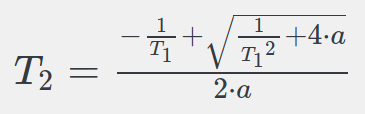

The formula just obtained can be used in a spreadsheet to obtain the values to be loaded into the *T0MR0* register of the *Timer0*. In the following figure an excerpt from the spreadsheet:

  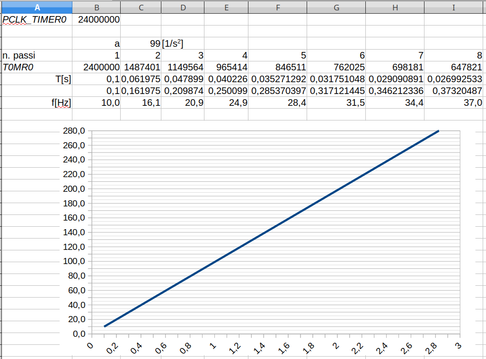

The first parameter *PCLK_TIMER0* represents the clock frequency of *Timer0* (24MHz). The acceleration *a* has been set assuming a stepper motor speed that passes from a minimum of 1/10 of a second (10Hz) to a maximum of 1/1000 of a second (1kHz) in 10 seconds of time:

  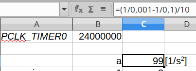

Line *T[s]* of the spreadsheet contains the values in seconds for the step time: the first value 0.1 s is set manually and corresponds to a frequency of 10 *Hz*, shown in line *f[Hz]*. The second value of *T[s]* is obtained with the formula seen above (using the time of the previous cell as T1 value and the value of cell *a* as acceleration):

  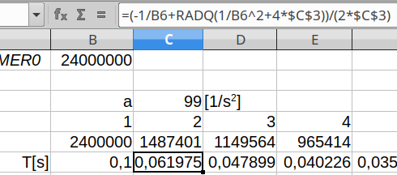

In line *T0MR0* we obtain the numerical value to be entered in the *Timer0* register, as the product between the constant *PCLK_TIMER0* (24MHz) and the current value of the step time in seconds *T[s]*. In the example in the figure:

<i>T0MR0 = 24MHz * 0.061975 = 1487401</i>

  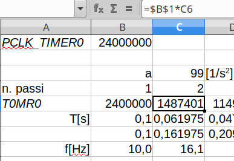

By expanding the calculation to the right for 400 steps (counted in the row *n. steps*) we obtain the sequence of values to be loaded into the vector *acc_times[]*.

The third row simply shows the sum of the times *T[s]* to get the total time elapsed from the beginning, useful for the final graph. Here, we can verify that from 0.1 seconds to 2.83 seconds the motor frequency goes from 10 *Hz* to 280.7 *Hz*, in linear progression, with an acceleration equal to:

<i>a = (280.7-10)/(2.83-0.1) ≈ 99 [1/s2]</i>

in line with the value chosen at the beginning in the spreadsheet.

The precise values at the end of the ramp (step 400) are shown in the following figure:

  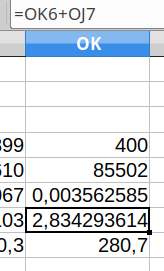

If you want to change the speed profile, you can choose different values for the acceleration, the minimum speed and the length of the vector. Naturally, everything must be calibrated on the real mechanics of use of the stepper motor.
